# UX Design Specification Plublista

**Author:** Utilisateur
**Date:** 2026-02-13

---

<!-- UX design content will be appended sequentially through collaborative workflow steps -->

## Executive Summary

### Project Vision

Plublista is an AI-powered content creation SaaS that transforms social media production from a fragmented, time-consuming manual process into an automated, algorithm-optimized workflow. The platform's hero feature — AI Auto-Montage — allows users to upload raw video clips and receive a fully edited, algorithm-optimized Reel in under 3 minutes. Combined with AI image generation, AI music, AI copywriting, and unified multi-platform publishing via Ayrshare, Plublista creates a "create once, publish everywhere" experience that replaces 5-6 separate tools.

The UX must serve three distinct user archetypes with vastly different needs: a non-technical marketing manager creating their first Reel ever, a freelance social media manager batch-producing 25 content pieces in a morning, and an agency founder standardizing production across a 5-person team. The design challenge is delivering simplicity for beginners while providing power and speed for professionals — within the same interface.

### Target Users

**Sophie — Freelance Social Media Manager (Primary Power User)**
- Manages 5-8 client Instagram accounts, produces 15 Reels + 10 Carousels weekly
- Core UX need: Speed and efficiency. Batch creation workflow. Minimal clicks between content pieces. Calendar-centric planning.
- Device: Desktop (primary), tablet (review). Batch sessions on Monday mornings.
- Tech comfort: High. Knows CapCut, Canva, Later. Will adopt new tools quickly if faster.

**Marc — Marketing Manager at SMB (Primary Onboarding User)**
- Sole marketer, no video editing experience, posts irregularly
- Core UX need: Simplicity and guidance. Must feel confident creating a Reel with zero video skills. Onboarding flow is critical.
- Device: Desktop. Occasional use (2-3 posts/week).
- Tech comfort: Medium. Uses standard business tools. Video editing is intimidating.

**Léa — Agency Founder (Growth/Scale User)**
- Runs 5-person agency, 25 client accounts, production is the bottleneck
- Core UX need: Standardization and oversight. Train juniors in 30 minutes. Review/approve workflow. Multi-account management (Phase 2).
- Device: Desktop. Delegates daily creation to team members.
- Tech comfort: High. Evaluates tools by team productivity impact and ROI.

### Key Design Challenges

1. **Complexity management**: The platform combines video editing, image generation, music creation, copywriting, scheduling, and multi-platform publishing. The UX must hide complexity behind progressive disclosure — showing the right features at the right time based on user context and skill level.

2. **Onboarding and time-to-value**: The target is < 5 minutes from signup to first published Reel. The onboarding flow must guide users through account creation, platform connection (OAuth), content upload, Auto-Montage generation, and publishing — each step must feel natural and achievable without documentation.

3. **Batch workflow performance**: Power users (Sophie) create 25+ content pieces in a single session. The UX must support rapid creation-review-schedule cycles with minimal navigation friction. Every unnecessary click or page load in this loop multiplies frustration by 25.

4. **Error communication and trust building**: Publishing failures (expired tokens, rejected formats, rate limits) must be clearly communicated with actionable recovery steps. Users managing client accounts have zero tolerance for unexplained failures — trust is the retention driver.

5. **Freemium-to-paid conversion**: The free tier must demonstrate enough value (5 Reels, 5 Carousels, Instagram only) while making upgrade paths visible and compelling. Quota communication must be transparent without blocking the creative flow.

### Design Opportunities

1. **"Zero-effort" creation pattern**: Auto-Montage enables the simplest content creation flow in the market — upload clips, one click, done. If the UX executes this flawlessly, it becomes the product's signature moment and primary viral driver.

2. **Calendar as command center**: For power users, the calendar view can serve as the primary interface — visualizing content plans, identifying gaps, and launching creation directly from empty date slots. This shifts the mental model from "tool" to "workflow hub."

3. **Progressive disclosure architecture**: The same interface serves beginners (simple mode with defaults) and power users (advanced options for styles, formats, platform-specific settings). The UI reveals complexity as users demonstrate readiness through usage patterns.

4. **AI-proposes-human-disposes pattern**: Auto-Montage generates a result, the user reviews and either accepts or refines. This "AI draft → human validation" loop can be the foundational interaction pattern across all features (copy, images, music, montage), creating a consistent and learnable UX.

## Core User Experience

### Defining Experience

The core experience of Plublista is **"Upload → AI Magic → Done."** The defining interaction is the Auto-Montage flow: a user uploads raw video clips, selects a style, and receives a fully edited, algorithm-optimized Reel — ready to publish. This single interaction must feel effortless, fast (< 3 minutes), and produce results that users are proud to publish without edits (>70% acceptance rate target).

The secondary core loop is the **batch creation cycle**: Create content → Review AI output → Accept/Refine → Schedule → Move to next piece. For power users (Sophie), this loop repeats 25+ times in a single session. Every second of friction in this loop costs minutes of productivity.

The tertiary experience is **calendar-driven planning**: View the week → Spot content gaps → Create directly from the calendar → Fill the schedule. This transforms Plublista from a "creation tool" into a "content workflow hub."

### Platform Strategy

**Primary platform: Desktop web application (responsive)**
- Content creation is a desktop workflow. Creators use large screens for video review, drag-and-drop, and multi-window work (reference images, client briefs alongside Plublista).
- React 18 + Vite + Tailwind CSS frontend. Remotion Player for in-browser video preview.
- Target browsers: Chrome, Firefox, Safari, Edge (latest 2 versions).

**Secondary platform: Tablet (responsive web)**
- Content review and approval on iPad/tablet. Calendar viewing. Quick scheduling adjustments.
- Not a creation-first experience — optimized for review and management.

**Not in scope for MVP: Native mobile app**
- Deferred to Phase 3. Mobile web is acceptable for quick checks.
- The creation workflow (uploading clips, reviewing Auto-Montage output) is inherently a desktop task.

**Platform constraints:**
- No offline functionality required — all AI processing is server-side.
- Video upload must handle files up to 200MB (Free) to 10GB (Agency) without timeout.
- Remotion Player must render previews at 30fps minimum for professional feel.
- OAuth flows for Instagram, YouTube, TikTok must work smoothly in-browser.

### Effortless Interactions

**1. Auto-Montage generation (Zero-Effort Creation)**
Upload clips → Select style → One click → Reel appears. No timeline editing. No manual cuts. No audio syncing. The AI handles everything. The user's only job is to say "yes" or "try again." This eliminates the #1 barrier to Reel creation for users like Marc who have never edited a video.

**2. Multi-platform publishing (One-Click Distribution)**
Content is ready → Select platforms (Instagram, YouTube, TikTok) → One click → Published everywhere with format auto-adapted (9:16, 16:9, 1:1). No platform switching. No manual reformatting. No separate login to each platform. Ayrshare handles the complexity invisibly.

**3. AI copy generation (Invisible Intelligence)**
Captions, hashtags, hook text, and CTAs are automatically generated alongside every content piece. The user sees suggested copy that's already algorithm-optimized. They can edit or accept — but they never face a blank text field. The AI writes first, the human refines.

**4. Calendar scheduling (Drag-and-Drop Planning)**
Created content appears in the calendar. Drag to reschedule. Drop on a date to plan. Visual content mix indicator shows whether the week has the right balance (3-4 Reels + 2-3 Carousels + 1-2 Posts). No complex scheduling dialogs — just drag, drop, done.

**5. Error recovery (Self-Healing System)**
When publishing fails, the system auto-retries with exponential backoff. When formats are rejected, the system auto-converts and retries. The user sees the resolution, not the problem. Failed posts show a single "Retry" button — one click to fix. The goal: users never need to contact support for publishing issues.

### Critical Success Moments

**Moment 1: "I made this?" (First Auto-Montage Result)**
The defining moment of the entire product. Marc uploads 2 mediocre phone videos, clicks Generate, and 2 minutes later sees a professional-looking Reel with music, cuts, and a hook. This is the moment that converts trial users to paying customers. If the quality disappoints here, the user leaves forever.
- *UX requirement:* The generation progress must feel exciting (progress indicator with preview snapshots), not anxious (spinning wheel with no feedback).

**Moment 2: "That's my whole week done" (Batch Session Complete)**
Sophie finishes scheduling 25 content pieces in 3 hours instead of 15. She sees the calendar filled for all 5 clients. This is the moment that drives retention and word-of-mouth.
- *UX requirement:* The batch workflow must have a "completion celebration" — a summary of what was created, scheduled, and the time saved.

**Moment 3: "It just works" (First Multi-Platform Publish)**
User publishes one piece of content and sees it live on Instagram, YouTube, AND TikTok — each in the correct format. No manual reformatting. This is the moment that justifies the subscription over free tools.
- *UX requirement:* Post-publish confirmation showing each platform with a direct link to the live content.

**Moment 4: "I fixed it in one click" (Error Recovery)**
A publication fails. The user sees a clear error badge, clicks it, sees the issue explained in plain language, and clicks "Retry" — problem solved. Trust reinforced.
- *UX requirement:* Error states must never be technical jargon. Always human-readable with a clear action button.

**Moment 5: "This pays for itself" (ROI Realization)**
After the first month, the user sees how much content they created vs. time spent. For Sophie: "You created 100 pieces of content this month. Estimated time saved: 40 hours." This is the moment that prevents churn.
- *UX requirement:* Monthly summary email or dashboard card showing productivity metrics.

### Experience Principles

1. **AI First, Human Always** — The AI generates the first draft of everything (montage, copy, images, music). The human validates, refines, or regenerates. Users never start from a blank canvas. But the human always has the final say — no auto-publishing, no AI decisions without approval.

2. **One Click, Not Ten** — Every core action should be achievable in the minimum possible clicks. Upload → Generate → Publish can be 3 clicks. Calendar scheduling is drag-and-drop. Multi-platform publishing is one toggle. If a competitor requires 10 steps, Plublista does it in 1-3.

3. **Show, Don't Tell** — Video previews instead of settings descriptions. Visual calendar instead of list views. Thumbnail grids instead of file names. Format previews (9:16, 16:9, 1:1) shown as visual frames, not radio buttons. The product is visual — the interface must be visual.

4. **Progressive Complexity** — New users see: Upload → Generate → Publish. Returning users discover: Style selection, format options, music choices. Power users access: Batch mode, keyboard shortcuts, calendar command center. The interface grows with the user — never overwhelming, never limiting.

5. **Confidence Through Transparency** — Users always know: what's happening (generation progress), what it will cost (quota usage), what went wrong (plain-language errors), and what to do next (clear CTAs). No black boxes. No surprise quota depletion. No unexplained failures.

## Desired Emotional Response

### Primary Emotional Goals

**1. Empowerment — "I can do this"**
The dominant emotion Plublista must evoke. Marc, who has never edited a video, should feel capable of producing professional Reels. The AI handles the hard parts, but the user feels like they did it. The product amplifies the user's abilities rather than replacing them. This is the emotion that drives adoption.

**2. Relief — "This used to take forever"**
Sophie's primary emotion. The transition from 15+ hours of manual work to 3 hours of AI-assisted creation should feel like a weight lifted. Every batch session should end with a sense of relief: "The week is handled." This is the emotion that drives retention.

**3. Pride — "Look what I made"**
The Auto-Montage result must make users feel proud of the output. Marc shows his boss. Sophie shares with her freelance peers. Léa shows clients. If users aren't proud enough to publish without edits, the emotional contract is broken. This is the emotion that drives virality.

### Emotional Journey Mapping

| Stage | Target Emotion | Anti-Emotion (Avoid) | Design Implication |
|-------|---------------|---------------------|-------------------|
| **Discovery** (landing page, "Made with Plublista") | Curiosity + Hope — "Could this really work for me?" | Skepticism — "Another AI gimmick" | Show real results, not promises. Demo video of Auto-Montage in action. Social proof from creators. |
| **Signup & Onboarding** | Excitement + Ease — "This is simple, I want to try it" | Overwhelm — "Too many options, too complex" | Minimal signup fields. Guided onboarding: connect Instagram → upload first clip → generate first Reel. No feature dump. |
| **First Auto-Montage** | Wonder + Pride — "I made this? It's actually good!" | Disappointment — "This doesn't look professional" | The first result MUST impress. Use the best default style. Show the result dramatically (fade-in reveal, not sudden load). |
| **Core Creation Loop** | Flow + Efficiency — "I'm in the zone, content is flowing" | Frustration — "This is slowing me down" | Minimize navigation. Batch-friendly UI. No page reloads between creations. Quick-action shortcuts. |
| **Publishing** | Confidence + Satisfaction — "It's live everywhere, and it looks right" | Anxiety — "Did it actually publish? Is the format correct?" | Immediate confirmation with platform links. Visual proof (thumbnail per platform). Status badges that update in real-time. |
| **Error/Failure** | Trust + Control — "Something went wrong but I can fix it easily" | Panic — "My client's post failed and I don't know why" | Human-language errors. One-click retry. Auto-recovery when possible. Proactive notification, not silent failure. |
| **Returning** | Familiarity + Momentum — "Let me pick up where I left off" | Confusion — "Where was I? What was I working on?" | Dashboard shows recent work, pending drafts, upcoming schedule. Resume exactly where you left off. |
| **Billing/Quota** | Fairness + Value — "I'm getting my money's worth" | Resentment — "I'm being nickel-and-dimed" | Clear quota display (not hidden). Generous thresholds before warnings. Upgrade framed as "unlock more" not "you've been limited." |

### Micro-Emotions

**Confidence over Confusion**
- Every screen answers "What do I do next?" without reading documentation
- Form fields have smart defaults (style: Dynamic, format: 9:16, duration: 30s)
- Preview before every irreversible action (publish confirmation)

**Excitement over Anxiety**
- Auto-Montage generation shows progress with preview snapshots ("Hook detected... Best moments selected... Music matched... Rendering...")
- First-time users get a "Welcome" celebration when their first Reel is generated
- Quota indicators use green (plenty) / amber (approaching) / red (low) — not arbitrary numbers

**Accomplishment over Frustration**
- Every creation session ends with a summary: "3 Reels + 2 Carousels created. Scheduled for the week."
- Calendar fills up visually as content is scheduled — a satisfying "completeness" feeling
- Monthly recap: "You created 45 pieces of content this month. Estimated time saved: 25 hours."

**Trust over Skepticism**
- Publishing success rate visible in dashboard (builds confidence over time)
- Error recovery is transparent: "Instagram token expired → Auto-refreshed → Post published successfully"
- No hidden costs. Quota usage always visible. No surprise charges.

**Delight over Mere Satisfaction**
- Occasional "wow" moments: an Auto-Montage that's better than expected, a particularly good AI caption, music that perfectly matches the mood
- Easter eggs for power users: keyboard shortcuts revealed progressively, "You've been on fire — 10 Reels this week!" mini-celebrations
- "Made with Plublista" watermark on free tier creates a subtle pride moment when content gets engagement

### Design Implications

| Emotional Goal | UX Design Approach |
|---------------|-------------------|
| **Empowerment** | AI does the work, user gets the credit. No "AI generated this" messaging. Frame as "Your Reel is ready." Results labeled as the user's creation, not the AI's output. |
| **Relief** | Time-saved metrics visible. Before/after comparisons implicit in the experience. Batch completion celebrations. Calendar view showing "week handled." |
| **Pride** | High-quality defaults. Preview that looks polished. Export in highest quality. "Made with Plublista" as a badge of quality, not a limitation. |
| **Confidence** | Smart defaults eliminate decision paralysis. Undo available everywhere. Preview before publish. Clear error messages with clear solutions. |
| **Flow state** | Minimal navigation between tasks. No modal interruptions during creation. Keyboard shortcuts for power users. Auto-save always on. |
| **Trust** | Transparent quota tracking. No silent failures. Publishing status always visible. Error recovery always available. Data deletion confirms what was removed. |

### Emotional Design Principles

1. **Celebrate, Don't Just Confirm** — When a user creates their first Reel, don't just show it. Make it feel like an achievement. When a batch session is complete, show the impact. When a post gets published to 3 platforms, show all three confirmations triumphantly. Micro-celebrations compound into product love.

2. **Anxiety Is the Enemy** — Every moment of uncertainty (Is it rendering? Did it publish? Am I running out of quota? Did my payment go through?) must be eliminated with clear, real-time feedback. Loading states must be informative. Errors must be actionable. Progress must be visible.

3. **The User Is the Creator, the AI Is the Tool** — Language throughout the interface must reinforce that the user created the content, not the AI. "Your Reel is ready" not "AI generated a Reel." "You've created 100 pieces of content this month" not "Plublista generated 100 pieces." This subtle framing drives emotional ownership and pride.

4. **Delight Through Speed** — The most emotionally impactful design decision is speed. A 30-second Auto-Montage generation feels magical. A 5-minute one feels broken. Fast page loads feel premium. Slow ones feel cheap. Invest in perceived and actual performance as a primary emotional design tool.

5. **Frustration Has a 3-Second Rule** — If a user is confused or stuck for more than 3 seconds, the design has failed. Every interaction must have an obvious next step. Every error must have a visible solution. Every screen must answer "Why am I here and what should I do?"

## UX Pattern Analysis & Inspiration

### Inspiring Products Analysis

**1. Canva — The "Anyone Can Design" Revolution**

Canva solved the same problem as Plublista but for graphic design: making professional creation accessible to non-designers. Their UX is the direct benchmark.

| UX Strength | How It Works | Lesson for Plublista |
|-------------|-------------|---------------------|
| **Template-first approach** | Users start from a template, not a blank canvas. Every template is professional-grade. | Auto-Montage should feel like an "intelligent template" — the AI creates the first version, the user refines. Never show a blank timeline. |
| **One-click magic** | "Magic Resize" adapts design to any format instantly. "Magic Background Remove" is one click. | Multi-format adaptation (9:16, 16:9, 1:1) should be one-click like Canva's Magic Resize. The "magic" metaphor resonates with users. |
| **Graduated complexity** | New users see simple drag-and-drop. Pro users discover layers, grids, brand kits. | Progressive disclosure from Simple Mode (Marc) to Power Mode (Sophie). Same interface, more depth revealed over time. |
| **Visual search** | Browse templates visually, not by text search. See the result before choosing. | Style selection for Auto-Montage should show visual previews (Dynamic style thumbnail, Cinematic thumbnail) — not text descriptions. |

**2. CapCut — Video Editing Made Accessible**

CapCut is the direct competitor for video creation. Understanding what they do well and where they fail informs Plublista's positioning.

| UX Strength | How It Works | Lesson for Plublista |
|-------------|-------------|---------------------|
| **Template-based video creation** | Pick a template, drop in your clips, export. Fast for beginners. | Auto-Montage goes further: users don't even choose a template — AI creates the edit from scratch. Position this as "beyond templates." |
| **One-tap effects** | Filters, transitions, text effects applied with single tap. | Style presets (Dynamic, Cinematic, UGC) should apply a complete "look" in one click — color grading, transition type, text style, music mood. |
| **Tutorial integration** | In-app tutorials contextual to what user is doing. | Onboarding tooltips that appear contextually: "First time creating a Carousel? Here's how reference images work." |

| UX Weakness | The Problem | Plublista's Advantage |
|-------------|------------|----------------------|
| **Timeline complexity** | Even simplified, the timeline UI intimidates non-editors like Marc | Plublista eliminates the timeline entirely for Auto-Montage. No tracks, no scrubbing, no keyframes. |
| **Watermark stigma** | CapCut watermarks are penalized by Instagram's algorithm | Plublista generates original content — no watermarks, no algorithm penalty. This is a UX story, not just a technical one. |
| **No publishing integration** | Create in CapCut, then manually upload to each platform | Plublista's one-click multi-platform publish is a massive UX advantage. Create and distribute in one tool. |

**3. Linear — The Speed-First SaaS Benchmark**

Linear (project management tool) has the best batch workflow UX in SaaS. Sophie's batch creation sessions need Linear-level speed.

| UX Strength | How It Works | Lesson for Plublista |
|-------------|-------------|---------------------|
| **Keyboard-first navigation** | Every action has a keyboard shortcut. Power users never touch the mouse. | Batch creation needs shortcuts: Cmd+N (new content), Cmd+Enter (accept & schedule), Cmd+K (command palette). |
| **Instant everything** | Pages load instantly. No spinners for navigation. Optimistic updates. | Dashboard, calendar, content list must load < 1s. Optimistic UI updates when scheduling. |
| **Command palette (Cmd+K)** | Quick access to any action from anywhere. | Cmd+K palette: "New Reel", "Open Calendar", "Go to Client X", "Check Quota" — instant access to everything. |
| **Batch operations** | Select multiple items, apply action to all at once. | Select multiple content pieces → "Schedule all", "Publish all to Instagram + TikTok", "Change format to 9:16." |

**4. Notion — The Progressive Disclosure Master**

Notion serves both simple note-takers and complex database builders with the same interface. This is exactly Plublista's challenge (Marc vs. Sophie).

| UX Strength | How It Works | Lesson for Plublista |
|-------------|-------------|---------------------|
| **Slash commands** | Type "/" to access all features. Simple for beginners, powerful for experts. | Could inspire quick-create: type "/" in calendar to instantly start "New Reel" or "New Carousel" without navigating away. |
| **Blocks architecture** | Everything is a block. Simple concept, infinite flexibility. | Content creation follows a "card" metaphor: every content piece is a card with thumbnail, status, platform badges, and quick actions. |
| **Sidebar navigation** | Clean hierarchy. Collapsible. Customizable. | Left sidebar: Dashboard, Create, Calendar, Library, Settings. Collapsible for more workspace during creation. |
| **Templates gallery** | Community templates for any use case. | Phase 3 vision: Template marketplace for montage styles, carousel designs, content strategies. |

### Transferable UX Patterns

**Navigation Patterns:**

| Pattern | Source | Application in Plublista |
|---------|--------|------------------------|
| **Persistent sidebar + main canvas** | Canva, Notion, Figma | Left sidebar (navigation) + main content area (creation/preview). Sidebar collapses during full-screen preview. |
| **Command palette (Cmd+K)** | Linear, Notion, VS Code | Global quick-access: search content, navigate to any view, start new creation, check quota — all from one shortcut. |
| **Contextual top bar** | Canva, Figma | Top bar changes based on context: Dashboard shows stats, Create shows content options, Calendar shows date navigation. |

**Interaction Patterns:**

| Pattern | Source | Application in Plublista |
|---------|--------|------------------------|
| **Drag-and-drop scheduling** | Google Calendar, Asana, Trello | Calendar view: drag content cards to dates/times. Drag to reschedule. Visual and intuitive. |
| **Preview-before-commit** | Canva (template preview), Spotify (song preview) | Every Auto-Montage result shows full preview before publish. Every style change shows live preview. No blind commits. |
| **One-click actions with undo** | Gmail (send + undo), Linear (archive + undo) | "Published!" with 5-second undo window. "Scheduled!" with immediate undo. Reduces anxiety about irreversible actions. |
| **Batch select + bulk action** | Linear, Gmail, Figma | Multi-select content pieces → bulk schedule, bulk publish, bulk change platform targets. Essential for Sophie's 25-piece sessions. |

**Visual Patterns:**

| Pattern | Source | Application in Plublista |
|---------|--------|------------------------|
| **Card-based content grid** | Pinterest, Dribbble, Instagram | Content library and dashboard show content as visual cards with thumbnails. Not a table — a visual grid that matches the visual nature of the product. |
| **Status badges/pills** | Linear (status dots), GitHub (PR labels) | Content status: Draft (gray), Scheduled (blue), Published (green), Failed (red). Visible at a glance on every content card. |
| **Progress with personality** | Stripe (payment processing), Vercel (deployment) | Auto-Montage generation: "Analyzing clips... Selecting best moments... Matching music... Rendering..." — informative progress that builds excitement. |
| **Split-panel layout** | VS Code, Figma | Creation view: left panel (options, settings) + right panel (live preview). User sees changes in real-time. |

### Anti-Patterns to Avoid

| Anti-Pattern | Where It Fails | Why Avoid for Plublista |
|-------------|---------------|------------------------|
| **Feature dump onboarding** | Many SaaS tools show all features in a tour on first login | Marc would be overwhelmed. Onboarding should show ONE thing: "Upload clips → Get a Reel." Everything else comes later. |
| **Settings-heavy creation** | Tools that require configuring 10 options before starting | Auto-Montage must work with ZERO configuration. Style: Dynamic (default). Format: 9:16 (default). Duration: 30s (default). One click to generate. Options available but never required. |
| **Modal overload** | Apps that pop up confirmation dialogs for every action | Scheduling, publishing, creating — all should happen fluidly without "Are you sure?" modals. Use undo instead of confirmation. |
| **Hidden errors** | Tools where publishing silently fails with no notification | Every failure must be visible, loud, and actionable. Red badge, notification, email. Never let a client's post fail silently. |
| **Forced upgrade walls** | Freemium products that block core features mid-workflow | Never block a user mid-creation. Show quota before they start ("2 Reels remaining this month"). If they're at quota, show upgrade option — don't destroy their work-in-progress. |
| **Timeline UI for non-editors** | CapCut, iMovie showing multi-track timelines to beginners | The timeline is the #1 reason non-editors abandon video creation. Auto-Montage eliminates it entirely. If a power feature needs a timeline (Scene Assembler, Phase 1.5), it's opt-in only. |

### Design Inspiration Strategy

**Adopt Directly:**
- Canva's visual-first template browsing → Style selection for Auto-Montage shows visual previews
- Linear's keyboard shortcuts and speed → Batch workflow shortcuts (Cmd+N, Cmd+Enter, Cmd+K palette)
- Card-based content grid → Dashboard and content library as visual grids with status badges
- Drag-and-drop scheduling → Calendar interaction pattern
- Progress-with-personality → Auto-Montage generation progress UI

**Adapt for Plublista:**
- Canva's Magic Resize → One-click format adaptation (9:16 → 16:9 → 1:1) but applied to video, not just images
- Linear's batch operations → Multi-select content + bulk schedule/publish, adapted for visual content cards
- Notion's progressive disclosure → Simple Mode (Marc) vs. Advanced Mode (Sophie), but triggered by usage patterns, not a settings toggle
- CapCut's one-tap effects → Style presets that apply a complete "look" (color + transitions + text + music mood) in one click

**Avoid Entirely:**
- CapCut's timeline UI → No timeline in Auto-Montage. Ever.
- Feature dump onboarding → One flow: "Make your first Reel in 5 minutes"
- Modal confirmation overload → Use undo patterns instead
- Silent failure states → Every error is visible and actionable
- Mid-workflow upgrade walls → Show quota upfront, never block mid-creation

## Design System Foundation

### Design System Choice

**Selected: Tailwind CSS + shadcn/ui (Themeable System approach)**

shadcn/ui is a collection of accessible, customizable React components built on Radix UI primitives and styled with Tailwind CSS. Unlike traditional component libraries (MUI, Ant Design), shadcn/ui components are copied directly into the project — no npm dependency, full ownership and control over every component.

This is the optimal choice for Plublista because it aligns perfectly with the existing tech stack (React 18 + Vite + Tailwind CSS) and provides the right balance of development speed and visual customization for a solo developer building an MVP.

### Rationale for Selection

**1. Stack alignment — Zero integration cost**
Tailwind CSS is already the chosen CSS framework. shadcn/ui is built on Tailwind, meaning zero learning curve for styling and no conflicting CSS approaches. Components are styled with the same utility classes used everywhere else in the app.

**2. Copy-paste ownership — No dependency lock-in**
Unlike MUI or Chakra UI, shadcn/ui components are owned by the project. They're copied into a `/components/ui` directory and can be modified freely. No version conflicts, no breaking changes from upstream, no bundle bloat from unused components.

**3. Radix UI primitives — Accessibility built-in**
Every shadcn/ui component is built on Radix UI, which provides WAI-ARIA compliant accessibility out of the box. Dialogs, dropdowns, toasts, tabs — all keyboard-navigable and screen-reader-friendly without extra effort.

**4. Modern aesthetic — Clean, professional, customizable**
shadcn/ui's default design is clean and modern — aligning with the "professional but approachable" visual identity Plublista needs. The dark/light mode support is built-in. The aesthetic is neutral enough to brand without a full redesign.

**5. Solo developer velocity — Right components for the job**
shadcn/ui provides exactly the components needed for Plublista's UI: Cards (content grid), Dialog (publish confirmation), Dropdown Menu (style selection), Calendar (scheduling), Tabs (navigation), Toast (notifications), Progress (Auto-Montage rendering), Badge (status pills), Command (Cmd+K palette).

**6. Community momentum — Best-in-class for 2026 React**
shadcn/ui is the most adopted component system in the React + Tailwind ecosystem as of 2026. Strong community, active maintenance, extensive examples, and wide adoption means proven patterns and easy troubleshooting.

### Implementation Approach

**Component architecture:**

```
src/
├── components/
│   ├── ui/              # shadcn/ui base components (Button, Card, Dialog, etc.)
│   ├── content/         # Content-specific components (ReelCard, CarouselBuilder, etc.)
│   ├── layout/          # Layout components (Sidebar, TopBar, MainCanvas)
│   └── features/        # Feature components (AutoMontage, Calendar, Dashboard)
```

**Key shadcn/ui components to use:**

| Component | Plublista Use Case |
|-----------|-------------------|
| **Card** | Content cards in grid (thumbnail + status + actions) |
| **Dialog** | Publish confirmation, error details, style preview |
| **Command** | Cmd+K command palette for global quick-access |
| **Calendar** | Content scheduling calendar view |
| **Tabs** | Navigation between content types, view modes |
| **Progress** | Auto-Montage rendering progress bar |
| **Badge** | Content status (Draft, Scheduled, Published, Failed) |
| **Toast** | Success/error notifications ("Published to 3 platforms!") |
| **Dropdown Menu** | Style selection, format selection, platform selection |
| **Sheet** | Mobile-friendly sidebar, settings panels |
| **Skeleton** | Loading states for content cards, previews |
| **Alert** | Quota warnings, error banners |
| **Avatar** | User profile, connected platform icons |

**Design token strategy (Tailwind CSS custom theme):**

| Token Category | Purpose | Example |
|---------------|---------|---------|
| **Colors** | Brand identity + semantic meaning | Primary (brand purple/blue), Success (green), Warning (amber), Error (red), Neutral (grays) |
| **Spacing** | Consistent layout rhythm | 4px base unit: 4, 8, 12, 16, 24, 32, 48, 64 |
| **Typography** | Readable, professional hierarchy | Inter (UI text), JetBrains Mono (code/stats), system font stack fallback |
| **Shadows** | Depth and elevation for cards, modals | sm (subtle cards), md (floating panels), lg (modals), xl (drag preview) |
| **Border radius** | Consistent roundness | sm (4px buttons), md (8px cards), lg (12px modals), full (circles/pills) |
| **Transitions** | Smooth, consistent animations | fast (150ms hover), normal (200ms state change), slow (300ms page transition) |

### Customization Strategy

**Brand customization layer:**
- Custom color palette extending shadcn/ui's default theme via `tailwind.config.ts`
- Brand-specific component variants (e.g., `ContentCard` extends `Card` with thumbnail + status badge + quick actions)
- Custom icons using Lucide (shadcn/ui's default icon set) supplemented with platform-specific icons (Instagram, YouTube, TikTok logos)

**Plublista-specific components (built on top of shadcn/ui):**

| Custom Component | Built From | Purpose |
|-----------------|-----------|---------|
| **ContentCard** | Card + Badge + DropdownMenu | Content grid card with thumbnail, status, platform badges, quick actions |
| **AutoMontageProgress** | Progress + custom steps | Multi-step progress indicator for AI generation |
| **PlatformSelector** | ToggleGroup + custom icons | Platform selection with visual icons (IG, YT, TT) |
| **QuotaIndicator** | Progress + Badge | Visual quota usage bar with color-coded thresholds |
| **FormatPreview** | Custom + aspect-ratio utilities | Visual format selector showing 9:16, 16:9, 1:1 frames |
| **StylePicker** | Card + visual thumbnails | Visual style selection grid with preview thumbnails |
| **ContentCalendar** | Calendar + ContentCard + DnD | Full content scheduling calendar with drag-and-drop |
| **CommandPalette** | Command | Global Cmd+K with Plublista-specific actions |

**Dark mode strategy:**
- Light mode as default (content creation benefits from bright, clean UI for accurate color preview)
- Dark mode available via toggle (for users who prefer it, especially during late editing sessions)
- Both modes fully supported via Tailwind's `dark:` variant and shadcn/ui's built-in theming

## Defining Core Interaction

### The Defining Experience

**"Upload your clips, AI creates the Reel."**

This is the sentence users will say to friends and colleagues. It's the Tinder-swipe of content creation — a radically simple abstraction of a complex process. The Auto-Montage flow is not just a feature; it's the product's identity.

The defining experience can be broken down into three acts:
1. **Input** — User uploads 1-10 raw video clips (the creative raw material)
2. **Magic** — AI analyzes, selects, cuts, enhances, adds music and text (the black box that creates value)
3. **Output** — A polished, algorithm-optimized Reel appears, ready to publish (the deliverable)

The user provides the raw material and receives the finished product. The entire creation process is invisible. This is fundamentally different from every existing video tool (CapCut, Canva, iMovie) that requires users to participate in the editing process.

### User Mental Model

**Current mental model (before Plublista):**
Users approach video creation with the mental model of "editing" — a multi-step, skill-dependent process: import clips → arrange on timeline → trim each clip → add transitions → sync music → add text → export → upload to platform → write caption. Each step requires a decision and a skill. The mental model is "I must become an editor to create content."

**Plublista's new mental model:**
"I provide the ingredients, AI cooks the meal." The mental model shifts from "editor" to "creative director" — the user makes high-level decisions (style, mood, format) while AI handles execution. This is the same mental model shift that Canva brought to graphic design: you don't need to be a designer, you need to know what you want.

**Mental model transitions by persona:**

| Persona | Old Mental Model | New Mental Model | Transition Risk |
|---------|-----------------|-----------------|-----------------|
| **Marc** | "I can't make videos, it's too technical" | "I just upload and the AI does it" | Low — he has no existing habits to unlearn. Pure delight. |
| **Sophie** | "I edit each clip manually in CapCut for 45 min" | "I upload and refine the AI result in 2 min" | Medium — she may want control she's used to having. Style/format options satisfy this. |
| **Léa** | "My juniors need training to edit properly" | "My juniors upload clips and review AI output" | Low — reduced training burden is the selling point. |

**Where confusion is likely:**
- "What if the AI cuts the wrong part?" → Solution: show what was selected, allow override
- "Can I customize the result?" → Solution: style presets satisfy 80%, Scene Assembler (Phase 1.5) for the 20%
- "How does it know what's a good hook?" → Solution: AI transparency ("Selected this clip as hook because: highest motion score, clear subject, good lighting")

### Success Criteria

**The core interaction succeeds when:**

| Criterion | Metric | Why It Matters |
|-----------|--------|---------------|
| **Speed** | < 3 minutes from upload to preview | Users expect "AI magic" to be fast. Beyond 3 min = "is it broken?" |
| **Quality** | > 70% acceptance rate (published without edits) | If users always need to edit, the "magic" is broken. 70% = "usually great, occasionally needs a tweak." |
| **Simplicity** | < 3 clicks from "New Reel" to "Generate" | Zero-configuration by default. Style and format optional. Upload → Generate is the minimal path. |
| **Delight** | User shows result to someone else | The "I made this?" moment. Emotional validation that the output is share-worthy. |
| **Confidence** | User publishes without preview anxiety | They trust the AI enough to schedule without second-guessing. Built over time through consistent quality. |
| **Repeatability** | User creates 5+ Reels in one session | The flow is fast enough and the results consistent enough for batch production. |

### Novel UX Patterns

**Novel: AI-as-Editor (No existing pattern)**
No mainstream product offers "upload raw video → receive finished edit." This is a genuinely novel interaction pattern. Users have no existing mental model for it, which means:
- The onboarding must educate without overwhelming
- The first result must be impressive to establish trust
- Progress feedback must explain what AI is doing ("Analyzing clips... Selecting best moments...")
- The metaphor of "AI assistant" or "AI editor" helps bridge understanding

**Established patterns we leverage:**
- File upload (drag-and-drop) — universally understood
- Style/preset selection (Canva, Instagram filters) — familiar pattern
- Video preview (YouTube, any video player) — no learning needed
- Publish button — universal call-to-action
- Calendar scheduling (Google Calendar) — proven pattern

**Novel combination: Upload → AI Generation → Preview → Publish**
The individual steps are familiar. The combination is novel. No tool currently connects these four steps in a seamless flow. The innovation is in the orchestration, not the individual interactions.

### Experience Mechanics

**1. Initiation — Starting the Auto-Montage**

| Trigger | Action | Context |
|---------|--------|---------|
| Dashboard "New Reel" button | Opens Auto-Montage creation view | Primary entry point for new users |
| Calendar empty slot "+" | Opens creation with date pre-filled | Power user entry from calendar view |
| Cmd+K → "New Reel" | Opens Auto-Montage creation view | Keyboard-first power users |
| Drag files onto Plublista window | Opens Auto-Montage with files pre-loaded | Fastest path for users with clips ready |

**2. Interaction — The Creation Flow**

```
Step 1: UPLOAD
┌─────────────────────────────────────────────┐
│  Drop your video clips here                  │
│  ┌───┐ ┌───┐ ┌───┐ ┌─────┐                │
│  │ 📹 │ │ 📹 │ │ 📹 │ │  +  │                │
│  │clip1│ │clip2│ │clip3│ │ Add │                │
│  │0:42 │ │1:15 │ │0:28 │ │     │                │
│  └───┘ └───┘ └───┘ └─────┘                │
│                                             │
│  Total: 2:25 of raw footage                 │
│                                             │
│  [Generate Auto-Montage]                    │
│                                             │
│  ── Optional Settings (collapsed) ──────── │
│  Style: Dynamic   Format: 9:16              │
│  Duration: 30s    Music: Auto-match         │
└─────────────────────────────────────────────┘
```

- Upload area accepts drag-and-drop or click-to-browse
- Clips show thumbnail + duration, removable with X
- "Generate" button is prominent and always visible
- Optional settings are collapsed by default (progressive disclosure)
- Defaults: Dynamic style, 9:16 format, 30s target, auto-matched music

```
Step 2: GENERATION (< 3 minutes)
┌─────────────────────────────────────────────┐
│  Creating your Reel...                       │
│                                             │
│  ✅ Analyzing clips (3 clips, 2:25 total)   │
│  ✅ Selecting best moments                   │
│     └─ Hook: clip2 at 0:03 (high energy)    │
│  ✅ Matching music to content mood            │
│  ⏳ Rendering final video...                 │
│  ○ Adding text overlays                      │
│                                             │
│  ████████████████░░░░░ 72%                  │
│                                             │
│  Estimated: 45 seconds remaining             │
└─────────────────────────────────────────────┘
```

- Multi-step progress with descriptive labels
- Each completed step shows a checkmark with detail
- AI decisions are visible ("Hook: clip2 at 0:03")
- Progress bar with percentage and time estimate

```
Step 3: RESULT PREVIEW
┌─────────────────────────────────────────────┐
│  Your Reel is ready!                         │
│                                             │
│  ┌─────────────────────┐  Caption:          │
│  │                     │  "These sneakers    │
│  │   9:16 VIDEO        │  change everything" │
│  │   PREVIEW           │                    │
│  │   (Remotion Player) │  Hashtags:          │
│  │                     │  #sneakers #style   │
│  │   ▶ Play            │  #fashion           │
│  │                     │                    │
│  └─────────────────────┘  Music: Energetic   │
│                            Pop (30s)         │
│                                             │
│  [Publish Now]  [Schedule]  [Regenerate]     │
│                                             │
│  Platforms: [IG ✓] [YT ✓] [TT ✓]           │
└─────────────────────────────────────────────┘
```

- Video preview with play controls (Remotion Player)
- AI-generated caption and hashtags shown alongside (editable)
- Music selection visible with preview option
- Three primary actions: Publish, Schedule, or Regenerate
- Platform toggles show which platforms will receive the content
- Caption and hashtags are editable inline — click to modify

**3. Feedback — Telling Users They're Succeeding**

| State | Feedback | Design |
|-------|----------|--------|
| Upload complete | "3 clips uploaded (2:25 total)" with thumbnails | Immediate visual confirmation |
| Generation in progress | Step-by-step progress with AI insights | Builds excitement, reduces anxiety |
| Result ready | "Your Reel is ready!" with video preview | Dramatic reveal — fade-in the preview |
| Published successfully | "Live on Instagram, YouTube, TikTok!" with links | Celebration moment — show all platform confirmations |
| Error during generation | "We couldn't process clip3 (corrupted file). Generated from clips 1-2." | Graceful degradation with clear explanation |

**4. Completion — What Happens After**

| Outcome | Next Action | UX Pattern |
|---------|------------|------------|
| Published | "Create another?" button + content appears in calendar | Quick loop back to creation |
| Scheduled | Calendar view highlights the scheduled slot | Visual confirmation of placement |
| Regenerated | New result appears in preview | Seamless replacement, no page reload |
| Saved as draft | Appears in dashboard "Drafts" section | Persistent, resumable later |
| Batch mode | "Next: Reel 4 of 15" with progress indicator | Session-aware batch counter |

## Visual Design Foundation

### Color System

**Brand Color Strategy: "Professional Creativity"**
Plublista needs to convey two seemingly contradictory qualities: creative energy (it's a content creation tool) and professional reliability (it handles client accounts and billing). The color system bridges this gap with a vibrant primary color paired with clean, neutral supporting tones.

**Primary Palette:**

| Role | Color | Hex | Usage |
|------|-------|-----|-------|
| **Primary** | Indigo/Violet | `#6366F1` (Indigo-500) | Primary buttons, active states, brand accents. Conveys creativity + technology. |
| **Primary Dark** | Deep Indigo | `#4338CA` (Indigo-700) | Hover states, active navigation, emphasis |
| **Primary Light** | Soft Indigo | `#A5B4FC` (Indigo-300) | Backgrounds, selected states, subtle accents |
| **Primary Subtle** | Ghost Indigo | `#EEF2FF` (Indigo-50) | Card backgrounds, hover highlights, gentle emphasis |

**Rationale for Indigo/Violet:** Indigo sits between blue (trust, reliability — Stripe, Linear) and purple (creativity, innovation — Figma, Notion). This positions Plublista as both creative and professional. It's distinctive from competitors: Canva (teal/purple), CapCut (black/red), Later (orange), Buffer (blue).

**Semantic Colors:**

| Role | Color | Hex | Usage |
|------|-------|-----|-------|
| **Success** | Emerald | `#10B981` | Published status, completed actions, positive feedback |
| **Warning** | Amber | `#F59E0B` | Quota approaching (80%), token expiry warnings |
| **Error** | Rose | `#F43F5E` | Failed publish, error states, destructive actions |
| **Info** | Sky | `#0EA5E9` | Scheduled status, informational messages, tips |

**Neutral Palette (Gray scale):**

| Role | Hex | Usage |
|------|-----|-------|
| **Gray 950** | `#0C0A09` | Primary text (light mode) |
| **Gray 700** | `#44403C` | Secondary text, labels |
| **Gray 500** | `#78716C` | Placeholder text, disabled states |
| **Gray 300** | `#D6D3D1` | Borders, dividers |
| **Gray 100** | `#F5F5F4` | Card backgrounds, subtle separators |
| **Gray 50** | `#FAFAF9` | Page background (light mode) |

**Platform-Specific Colors (used only for platform icons/badges):**

| Platform | Color | Usage |
|----------|-------|-------|
| Instagram | `#E4405F` | Platform badge, connection status |
| YouTube | `#FF0000` | Platform badge |
| TikTok | `#000000` | Platform badge |
| Facebook | `#1877F2` | Platform badge |
| LinkedIn | `#0A66C2` | Platform badge |
| X/Twitter | `#000000` | Platform badge |

**Content Status Colors (consistent throughout the app):**

| Status | Color | Badge Style |
|--------|-------|------------|
| Draft | Gray-500 `#78716C` | Outline badge, muted |
| Generating | Primary `#6366F1` | Animated pulse badge |
| Scheduled | Sky `#0EA5E9` | Solid badge |
| Published | Emerald `#10B981` | Solid badge |
| Failed | Rose `#F43F5E` | Solid badge with icon |

### Typography System

**Font Stack:**

| Role | Font | Fallback | Rationale |
|------|------|----------|-----------|
| **UI Text** | Inter | system-ui, -apple-system, sans-serif | The standard for modern SaaS. Highly legible at all sizes. Excellent for dense interfaces. Variable font = one file, all weights. |
| **Headings** | Inter (semi-bold/bold) | Same stack | Keeping one font family for simplicity. Weight variation creates hierarchy. |
| **Monospace** | JetBrains Mono | ui-monospace, monospace | Used sparingly for quota numbers, API cost displays, generation time counters. |

**Type Scale (based on 16px base):**

| Level | Size | Weight | Line Height | Usage |
|-------|------|--------|-------------|-------|
| **Display** | 36px / 2.25rem | Bold (700) | 1.2 | Page titles ("Dashboard", "Calendar") |
| **H1** | 30px / 1.875rem | Semi-bold (600) | 1.3 | Section titles within pages |
| **H2** | 24px / 1.5rem | Semi-bold (600) | 1.35 | Sub-sections, modal titles |
| **H3** | 20px / 1.25rem | Medium (500) | 1.4 | Card titles, group headers |
| **H4** | 16px / 1rem | Medium (500) | 1.5 | Sub-headings, label groups |
| **Body** | 14px / 0.875rem | Regular (400) | 1.6 | Default text, descriptions, captions |
| **Small** | 12px / 0.75rem | Regular (400) | 1.5 | Meta information, timestamps, badge text |
| **Tiny** | 11px / 0.6875rem | Medium (500) | 1.4 | Status labels, quota numbers, very small UI elements |

**Typography principles:**
- Body text at 14px (not 16px) — denser interfaces suit content management tools where users scan rather than read
- Generous line height (1.5-1.6) for body text ensures readability in quick scanning
- Weight variation (400-700) creates hierarchy without size changes where space is constrained
- Minimum touch target text: 14px for interactive elements

### Spacing & Layout Foundation

**Spacing Scale (4px base unit):**

| Token | Value | Usage |
|-------|-------|-------|
| `space-1` | 4px | Tight spacing: icon-to-text, badge padding |
| `space-2` | 8px | Compact spacing: button padding, input padding |
| `space-3` | 12px | Standard spacing: between related elements |
| `space-4` | 16px | Section spacing: between form fields, list items |
| `space-5` | 20px | Group spacing: between card sections |
| `space-6` | 24px | Container padding: card inner padding |
| `space-8` | 32px | Large spacing: between major sections |
| `space-10` | 40px | Page spacing: top/bottom page margins |
| `space-12` | 48px | Extra-large: between page sections |
| `space-16` | 64px | Maximum: page-level vertical rhythm |

**Layout Structure:**

```
┌────────────────────────────────────────────────────┐
│  Top Bar (56px height)                              │
│  Logo | Navigation Context | Quota | User Avatar    │
├──────────┬─────────────────────────────────────────┤
│          │                                         │
│ Sidebar  │  Main Content Area                      │
│ (240px)  │  (fluid, min 800px)                     │
│          │                                         │
│ Dashboard│  ┌─────────────────────────────────┐   │
│ Create   │  │  Content Area                    │   │
│ Calendar │  │  (padded 24px)                   │   │
│ Library  │  │                                  │   │
│ Settings │  │                                  │   │
│          │  └─────────────────────────────────┘   │
│          │                                         │
├──────────┴─────────────────────────────────────────┤
│  (No footer — maximizes vertical space)             │
└────────────────────────────────────────────────────┘
```

**Layout principles:**
- **Sidebar + Main Canvas:** Persistent sidebar (240px, collapsible to 64px icon-only) + fluid main content area. Inspired by Linear, Notion, Figma.
- **Top bar:** Fixed at 56px. Shows contextual information (page title, quick actions) + persistent elements (quota indicator, user avatar).
- **No footer:** Content creation tools maximize vertical space. No wasted footer area.
- **Content grid:** CSS Grid with responsive columns: 1 column (< 768px), 2 columns (768-1024px), 3 columns (1024-1440px), 4 columns (> 1440px).
- **Card density:** Content cards have 16px gap between them. Cards have 16px internal padding. Compact but not cramped.

**Responsive breakpoints:**

| Breakpoint | Width | Layout Change |
|-----------|-------|---------------|
| **Mobile** | < 768px | Sidebar becomes hamburger menu. Single column. Sheet overlays. |
| **Tablet** | 768-1024px | Sidebar collapses to icons. 2-column grid. |
| **Desktop** | 1024-1440px | Full sidebar. 3-column grid. Split-panel creation view. |
| **Wide** | > 1440px | Full sidebar. 4-column grid. More content visible at once. |

### Accessibility Considerations

**Color Contrast:**
- All text meets WCAG 2.1 AA minimum contrast ratio (4.5:1 for normal text, 3:1 for large text)
- Primary Indigo (#6366F1) on white (#FFFFFF) = 4.6:1 ratio (passes AA)
- Error Rose (#F43F5E) on white = 4.4:1 (passes AA for large text, supplemented with icon for small text)
- Status colors are never the sole indicator — always paired with text labels or icons

**Interactive Elements:**
- Minimum touch/click target: 44x44px (WCAG 2.5.5)
- Focus indicators: visible 2px ring in Primary color on all interactive elements
- Keyboard navigation: all actions achievable via keyboard (Tab, Enter, Escape, Arrow keys)
- Skip-to-content link for screen readers

**Motion and Animation:**
- All animations respect `prefers-reduced-motion` media query
- Auto-Montage progress animation has a static fallback
- No auto-playing video or flashing content

**Content Accessibility:**
- Alt text for all generated images and thumbnails
- Video previews have play/pause controls (no autoplay with sound)
- Error messages are announced to screen readers via ARIA live regions
- Quota warnings use both color and text description

## Design Direction Decision

### Design Directions Explored

Six comprehensive design directions were created and visualized in an interactive HTML showcase (`ux-design-directions.html`):

**Direction 1: Dashboard Hub**
The central command center view — a stats grid at the top (Total Reels, Scheduled, Published, AI Quota) with content cards below in a visual grid layout. Persistent sidebar navigation (Dashboard, Create, Calendar, Library, Settings) with a top bar showing quota indicator and user avatar. This direction emphasizes at-a-glance productivity metrics and recent content management.

**Direction 2: Auto-Montage Upload**
The hero creation experience — collapsed icon-only sidebar to maximize workspace, centered dropzone with drag-and-drop, uploaded clip cards showing thumbnails and durations, and a prominent "Generate Auto-Montage" button. Optional settings (Style, Format, Duration, Music) visible but non-intrusive. This direction prioritizes the core creation flow with maximum simplicity.

**Direction 3: Result Preview (Split Panel)**
The AI output review experience — a split-panel layout with phone-frame video preview on the left (9:16 aspect ratio) and edit panel on the right containing AI-generated caption, hashtags, music selection, and platform toggles (IG, YT, TT). Three primary actions: Publish Now, Schedule, Regenerate. This direction emphasizes the "AI proposes, human disposes" pattern.

**Direction 4: Calendar Command Center**
The content planning hub — a weekly calendar grid (Mon-Sun) with color-coded content cards (Reels in indigo, Carousels in emerald, Posts in sky blue). Content mix indicator shows weekly balance. Quick-add "+" buttons on each day. This direction serves power users (Sophie) who plan content across multiple client accounts.

**Direction 5: Generation Progress**
The AI transparency experience — a centered progress card showing step-by-step AI processing (Analyzing clips → Selecting moments → Matching music → Rendering → Adding overlays) with completion percentages, AI decision explanations ("Hook: clip2 at 0:03 — high energy opening"), and time estimates. This direction builds trust through transparency during the "magic" phase.

**Direction 6: Publish Confirmation**
The celebration moment — a success modal showing multi-platform publish confirmation with live links to each platform (Instagram, YouTube Shorts, TikTok), post preview thumbnails, and a congratulatory message. "Create Another" and "View Calendar" CTAs. This direction embodies the "Celebrate, Don't Just Confirm" emotional design principle.

### Chosen Direction

**Composite approach: All six directions represent different screens within a single cohesive application flow.**

Rather than choosing one direction over another, the six directions form the complete Plublista user journey:
1. **Dashboard Hub** → Landing screen and content management
2. **Auto-Montage Upload** → Content creation entry point
3. **Generation Progress** → AI processing feedback
4. **Result Preview** → Output review and editing
5. **Publish Confirmation** → Success celebration
6. **Calendar Command Center** → Content planning and scheduling

Each direction was designed with consistent design tokens (Indigo #6366F1 primary, Inter typography, 4px spacing base, shadcn/ui component patterns) ensuring visual coherence across all screens.

### Design Rationale

| Decision | Rationale |
|----------|-----------|
| **Sidebar + Canvas layout** | Proven pattern (Linear, Notion, Figma) that scales from simple dashboard to complex creation views. Collapsible sidebar adapts from Marc's simple needs to Sophie's power workflow. |
| **Card-based content grid** | Visual product demands visual interface. Thumbnails convey more than text lists. Cards support status badges, platform icons, and quick actions in a scannable format. |
| **Split-panel creation view** | Preview + controls side-by-side eliminates context switching. Users see changes immediately. Matches the mental model of "reviewing AI output." |
| **Step-by-step progress** | Transparent AI processing builds trust and excitement. Users understand what the AI is doing, reducing "black box" anxiety. Turns wait time into engagement time. |
| **Celebration modals** | Multi-platform publish is a high-value moment. Celebrating it reinforces the product's value proposition ("This used to take 30 minutes, now it's one click"). |
| **Calendar as command center** | Power users think in weeks and months, not individual posts. Calendar view transforms Plublista from "content tool" to "content workflow hub." |

### Implementation Approach

**Screen priority order for development:**

| Priority | Screen | Rationale |
|----------|--------|-----------|
| **P0** | Auto-Montage Upload | Core product experience. Without this, there's no product. |
| **P0** | Generation Progress | Users need feedback during AI processing. Critical for trust. |
| **P0** | Result Preview | Users must review AI output before publishing. |
| **P1** | Dashboard Hub | Landing page and content management. Needed for returning users. |
| **P1** | Publish Confirmation | Celebration and multi-platform confirmation. |
| **P1** | Calendar Command Center | Content planning. Essential for power users but not day-one critical. |

**Component reuse strategy:**
- Sidebar component shared across all screens (persistent navigation)
- Top bar component shared across all screens (contextual content changes)
- ContentCard component reused in Dashboard, Calendar, and Library views
- Badge/Status components universal across all content displays
- Platform toggle component reused in Upload, Preview, and Calendar views

## User Journey Flows

### Journey 1: First Reel — Onboarding to First Publish (Marc)

**Goal:** Marc goes from signup to his first published Reel in < 5 minutes.

**Entry point:** "Made with Plublista" watermark on a competitor's Reel → Landing page → Sign up

```mermaid
flowchart TD
    A[Landing Page] --> B{Sign Up Method}
    B -->|Google OAuth| C[Account Created]
    B -->|Email + Password| C
    C --> D[Welcome Screen: 'Let's create your first Reel in 5 minutes']
    D --> E[Step 1: Connect Instagram]
    E --> F{Instagram OAuth}
    F -->|Success| G[✅ Instagram Connected - Trust badge shown]
    F -->|Declined| H[Skip for now - can connect later]
    F -->|Error| I[Clear error + Retry button]
    I --> F
    G --> J[Step 2: Upload Your First Clips]
    H --> J
    J --> K[Drag-and-drop zone with helper text]
    K --> L{Clips Uploaded?}
    L -->|Yes - 1-10 clips| M[Show clip thumbnails + total duration]
    L -->|No clips yet| N[Suggest: 'Use your phone videos - even selfies work!']
    N --> K
    M --> O[Step 3: Generate - Big CTA 'Create My Reel']
    O --> P[Generation Progress Screen]
    P --> P1[✅ Analyzing clips]
    P1 --> P2[✅ Selecting best moments]
    P2 --> P3[✅ Matching music]
    P3 --> P4[✅ Rendering]
    P4 --> P5[✅ Adding text overlays]
    P5 --> Q[🎉 'Your Reel is ready!' - Dramatic reveal]
    Q --> R[Preview with Remotion Player]
    R --> S{User Decision}
    S -->|Love it| T[Publish Now]
    S -->|Want changes| U[Regenerate with different style]
    S -->|Not ready| V[Save as Draft]
    U --> O
    T --> W{Instagram Connected?}
    W -->|Yes| X[Publish Confirmation: '🎉 Live on Instagram!']
    W -->|No| Y[Download video + prompt to connect]
    X --> Z[Onboarding Complete: 'Welcome to Plublista!']
    V --> Z
    Y --> Z
    Z --> AA[Dashboard with first content card visible]
```



**Key UX decisions:**
- Onboarding is linear (3 steps max), not a feature tour
- Instagram connection is encouraged but not required (reduces friction)
- Default settings are pre-selected (Dynamic style, 9:16, 30s) — zero configuration
- First generation uses the best default style to maximize "wow" moment
- Dramatic reveal of first Reel (fade-in animation, not sudden load)
- "I made this?" moment is the emotional climax of the entire onboarding

**Error handling:**
- OAuth failure: clear message + retry, never a dead end
- Upload failure: file format guidance ("We support MP4, MOV, WebM")
- Generation failure: "Let's try again with different clips" — graceful retry

### Journey 2: Auto-Montage Creation Flow (Sophie — Power User)

**Goal:** Sophie creates a single Auto-Montage Reel with maximum efficiency.

**Entry point:** Dashboard "New Reel" button / Calendar "+" / Cmd+K → "New Reel" / Drag files onto window


**Key UX decisions:**
- Sidebar collapses to icons during creation (maximize workspace)
- Settings collapsed by default (progressive disclosure)
- Generation progress shows AI decisions transparently
- Split-panel result view: preview + edit controls side by side
- Caption/hashtags are editable inline (click-to-edit, not a separate screen)
- "Create Another" loops back for batch workflow efficiency
- Keyboard shortcuts: Cmd+Enter to generate, Cmd+S to save draft

### Journey 3: Batch Session & Calendar Scheduling (Sophie — Monday Morning)

**Goal:** Sophie creates and schedules 25 content pieces (15 Reels + 10 Carousels) across 7 client accounts in 3 hours.

```mermaid
flowchart TD
    A[Monday 8am - Sophie opens Plublista] --> B[Dashboard: Shows weekly overview]
    B --> C[Calendar View: See gaps across all clients]
    C --> D{Content Type}
    D -->|Reel needed| E[New Reel - Auto-Montage Flow]
    D -->|Carousel needed| F[New Carousel - AI Image Flow]
    E --> G[Upload clips → Generate → Review → Accept]
    F --> H[Upload references → AI generates slides → Review → Accept]
    G --> I[Content ready - Add to schedule]
    H --> I
    I --> J{Schedule Method}
    J -->|Quick schedule| K[Click suggested time slot]
    J -->|Drag to calendar| L[Drag content card to specific date/time]
    J -->|Publish immediately| M[Multi-platform publish now]
    K --> N[Content placed in calendar - visual confirmation]
    L --> N
    M --> O[Publish confirmation with platform links]
    N --> P{More content to create?}
    O --> P
    P -->|Yes| Q[Session counter: 'Reel 4 of 15']
    P -->|No - All done| R[Batch Complete Summary]
    Q --> D
    R --> S[🎉 Session Summary]
    S --> S1[Created: 15 Reels + 10 Carousels]
    S --> S2[Scheduled: 25 posts across 5 clients]
    S --> S3[Platforms: Instagram + TikTok + YouTube]
    S --> S4[Estimated time saved: 12 hours]
    S --> S5[Calendar preview: Full week at a glance]
```



**Batch workflow optimizations:**
- Session counter ("Reel 4 of 15") provides progress awareness
- "Create Another" returns to upload with last-used settings remembered
- Calendar auto-suggests optimal posting times per platform
- Batch completion celebration shows impact metrics (time saved, content created)
- Keyboard shortcuts eliminate mouse dependency: Cmd+N (new), Cmd+Enter (generate), Cmd+Shift+S (schedule)
- Content cards in calendar are color-coded: Reels (indigo), Carousels (emerald), Posts (sky)

### Journey 4: Multi-Platform Publishing Flow

**Goal:** User publishes one content piece to multiple platforms simultaneously with correct format adaptation.

```mermaid
flowchart TD
    A[Content Ready - Preview Screen] --> B[Platform Selection]
    B --> B1[Toggle: Instagram ✓]
    B --> B2[Toggle: YouTube Shorts ✓]
    B --> B3[Toggle: TikTok ✓]
    B --> B4[Toggle: Facebook □]
    B --> B5[Toggle: LinkedIn □]
    B1 --> C{Format Check}
    B2 --> C
    B3 --> C
    C -->|All formats compatible| D[Preview per platform]
    C -->|Format adaptation needed| E[Auto-adapt: 9:16 → 16:9 for YouTube]
    E --> D
    D --> D1[Instagram preview: 9:16 with caption]
    D --> D2[YouTube preview: Shorts format with title]
    D --> D3[TikTok preview: 9:16 with hashtags]
    D --> F[Publish Button - 'Publish to 3 platforms']
    F --> G[Publishing in progress...]
    G --> G1[Instagram: Publishing... ✅ Published!]
    G --> G2[YouTube: Publishing... ✅ Published!]
    G --> G3[TikTok: Publishing... ✅ Published!]
    G1 --> H{All succeeded?}
    G2 --> H
    G3 --> H
    H -->|All success| I[🎉 Celebration Modal]
    H -->|Partial failure| J[Success + Error Summary]
    I --> I1[Links to live posts on each platform]
    I --> I2['Create Another' CTA]
    I --> I3['View in Calendar' CTA]
    J --> J1[✅ Instagram: Live - link]
    J --> J2[❌ TikTok: Rate limit - Auto-retry in 1h]
    J --> J3[Retry Now / Dismiss options]
    J3 -->|Retry| K[Retry failed platforms]
    K --> G
    J3 -->|Dismiss| L[Dashboard - Failed badge on content card]
```



**Key UX decisions:**
- Platform toggles are visual (platform logos, not checkboxes)
- Format adaptation happens automatically with visual preview
- Publishing shows real-time status per platform (not a single spinner)
- Celebration modal for full success — shows live links
- Partial failure shows what worked AND what didn't — never hides errors
- Auto-retry for transient errors (rate limits) with manual retry option

### Journey 5: Error Recovery Flow (Marc — Failed Publish)

**Goal:** Marc discovers a publishing failure and resolves it in < 30 seconds with one click.


**Error recovery principles:**
- Errors are NEVER technical jargon — always human-readable
- Every error has a visible solution (button or instruction)
- Auto-recovery happens silently when possible (rate limits, token refresh)
- Red badges are impossible to miss — dashboard and notification bar
- One-click fix for format errors (auto-conversion)
- Error resolution updates status in real-time (red → green badge)
- Failed posts never silently disappear — accountability is maintained

### Journey Patterns

**Common patterns extracted across all 5 journeys:**

| Pattern | Usage | Implementation |
|---------|-------|----------------|
| **Progressive Entry** | Users enter flows from multiple points (dashboard, calendar, Cmd+K, drag-and-drop) | Every major flow has 3-4 entry points. Context is preserved regardless of entry. |
| **AI-First Default** | Every creation starts with AI-generated content (montage, caption, hashtags, images) | User never faces a blank canvas. AI provides the first draft, user refines. |
| **Transparent Progress** | Long operations show step-by-step progress with AI decisions visible | Multi-step progress indicators with descriptive labels and time estimates. |
| **Preview-Before-Commit** | Every irreversible action shows a preview first | Split-panel preview before publish. Calendar preview before scheduling. Platform preview before multi-publish. |
| **One-Click Recovery** | Errors have a single-button fix whenever possible | "Fix & Republish", "Retry", "Reconnect" — one click to resolve. |
| **Celebration at Completion** | Every successful action gets acknowledged proportionally | Small toast for save. Modal celebration for first Reel. Summary for batch completion. |
| **Session Awareness** | Batch workflows track progress across the session | "Reel 4 of 15" counter. Batch summary at end. Last-used settings remembered. |

### Flow Optimization Principles

**1. Minimum Clicks to Value**

| Journey | Steps to Value | Optimization |
|---------|---------------|--------------|
| First Reel (Marc) | 3 steps: Upload → Generate → Publish | Zero-config defaults eliminate settings step |
| New Reel (Sophie) | 2 steps: Upload → Generate (settings remembered) | Last-used settings auto-applied |
| Schedule content | 1 step: Drag to calendar | No scheduling dialog — direct manipulation |
| Error recovery | 1 step: Click "Fix" | Auto-diagnosis + one-click resolution |

**2. Cognitive Load Management**
- Maximum 3 choices per screen (no decision paralysis)
- Settings hidden by default, revealed on demand (progressive disclosure)
- Smart defaults pre-selected based on user history and best practices
- Inline editing (click-to-edit) instead of separate edit screens

**3. Feedback Loop Speed**
- Upload confirmation: instant (< 1s)
- Generation progress: real-time updates every 5 seconds
- Publish confirmation: < 3 seconds after completion
- Error notification: immediate (never silent failure)
- Calendar update: optimistic UI (instant visual update, background sync)

**4. Batch Workflow Acceleration**
- Settings persistence across creation session (last style/format remembered)
- "Create Another" loops back without navigation
- Keyboard shortcuts for power users (Cmd+N, Cmd+Enter, Cmd+Shift+S)
- Session counter maintains awareness without interruption
- Calendar auto-suggests next available optimal time slot

## Component Strategy

### Design System Components

**shadcn/ui Components — Coverage Analysis:**

Based on our 5 user journeys and 6 design directions, here is the complete mapping of shadcn/ui components to Plublista use cases:

| shadcn/ui Component | Plublista Use Case | Journey Coverage |
|---------------------|-------------------|-----------------|
| **Button** | Primary CTAs ("Generate", "Publish", "Schedule"), secondary actions ("Regenerate", "Save Draft") | All journeys |
| **Card** | Content cards in dashboard grid, clip upload cards, stat cards | J1, J2, J3 |
| **Dialog** | Publish confirmation modal, celebration modal, error detail panel | J4, J5 |
| **Command** | Cmd+K command palette — global quick-access to all actions | J2, J3 |
| **Calendar** | Content scheduling calendar foundation | J3 |
| **Tabs** | Navigation between content types, view mode switching | J2, J3 |
| **Progress** | Auto-Montage rendering progress bar | J1, J2 |
| **Badge** | Content status (Draft, Generating, Scheduled, Published, Failed) | All journeys |
| **Toast** | Success notifications ("Published!"), error alerts, save confirmations | All journeys |
| **DropdownMenu** | Style selection, format selection, content card quick actions | J1, J2 |
| **Sheet** | Mobile sidebar, settings panels, error detail overlay | J5 |
| **Skeleton** | Loading states for content cards, dashboard stats, calendar slots | J1, J3 |
| **Alert** | Quota warnings, error banners, onboarding tips | J3, J5 |
| **Avatar** | User profile, connected platform icons in top bar | All journeys |
| **Toggle** | Platform selection toggles (IG, YT, TT) | J4 |
| **ToggleGroup** | Multi-platform selection group | J4 |
| **Tooltip** | Keyboard shortcut hints, feature explanations, status details | J2, J3 |
| **ScrollArea** | Content library scrolling, clip list scrolling | J2, J3 |
| **Separator** | Section dividers in settings, sidebar groups | All journeys |
| **Input** | Caption editing, hashtag editing, search | J1, J2 |
| **Textarea** | Multi-line caption editing | J2 |
| **Label** | Form field labels, setting descriptions | All journeys |
| **Select** | Style picker dropdown, duration picker, format picker | J1, J2 |
| **Switch** | Toggle settings (dark mode, auto-retry, notifications) | Settings |
| **Popover** | Date picker popover, quick action menus | J3 |
| **AlertDialog** | Destructive action confirmations (delete content, disconnect platform) | Edge cases |

**Coverage assessment:** shadcn/ui covers ~70% of component needs. The remaining 30% requires custom components built on top of shadcn/ui primitives using established design tokens.

### Custom Components

**8 custom components required, designed with full specifications:**

#### 1. ContentCard

**Purpose:** The primary visual representation of a content piece (Reel, Carousel, Post) throughout the application. Used in Dashboard grid, Calendar slots, Library, and search results.

**Anatomy:**
```
┌──────────────────────────┐
│  ┌────────────────────┐  │
│  │                    │  │
│  │   THUMBNAIL        │  │
│  │   (16:9 crop)      │  │
│  │                    │  │
│  │  ▶ 0:30    [···]  │  │
│  └────────────────────┘  │
│                          │
│  My Product Showcase      │
│                          │
│  ● Published  Feb 13     │
│  [IG] [YT] [TT]         │
└──────────────────────────┘
```

**Content:** Thumbnail image/video frame, content title (truncated), status badge, creation date, platform badges, duration (for video), content type indicator (Reel/Carousel/Post)

**Actions:** Click to open preview, hover to show quick actions (Edit, Schedule, Duplicate, Delete), right-click context menu, drag to calendar for scheduling

**States:**

| State | Visual | Behavior |
|-------|--------|----------|
| Default | Card with thumbnail, title, status badge | Static display |
| Hover | Slight elevation (shadow-md), quick action overlay | Shows ··· menu and play button |
| Selected | Indigo border ring (2px), checkbox visible | Part of batch selection |
| Generating | Pulsing indigo badge, animated skeleton thumbnail | Thumbnail animates until generation complete |
| Draft | Gray-500 outline badge "Draft" | Muted visual treatment |
| Scheduled | Sky solid badge "Scheduled" with date | Shows scheduled date/time |
| Published | Emerald solid badge "Published" | Platform links available |
| Failed | Rose solid badge "Failed" with warning icon | Red border accent, error action visible |
| Dragging | Elevated (shadow-xl), slight rotation, opacity 0.8 | Follows cursor during calendar drag |

**Variants:**
- **Grid card** (default): 240px wide, used in dashboard and library grids
- **Calendar card** (compact): 160px wide, fits within calendar day cells
- **List item**: Full-width horizontal layout for list view mode
- **Mini card**: 80px thumbnail only for batch selection overview

**Accessibility:** Alt text on thumbnail, role="article", aria-label with content title and status, keyboard focusable (Tab), Enter to open, Space to select, context menu via Shift+F10

**Built from:** Card + Badge + DropdownMenu + Skeleton

#### 2. AutoMontageProgress

**Purpose:** Multi-step progress indicator showing AI generation pipeline with transparent decision explanations. The centerpiece of the "magic" phase.

**Anatomy:**
```
┌──────────────────────────────────┐
│  Creating your Reel...           │
│                                  │
│  ✅ Analyzing clips (3 clips)    │
│  ✅ Selecting best moments       │
│     └─ Hook: clip2 at 0:03      │
│  ✅ Matching music               │
│  ⏳ Rendering final video...     │
│  ○ Adding text overlays          │
│                                  │
│  ████████████████░░░░ 72%        │
│                                  │
│  Estimated: 45 seconds remaining │
└──────────────────────────────────┘
```

**Content:** Step list with status icons (✅ complete, ⏳ in progress, ○ pending), AI decision details as sub-items, overall progress bar with percentage, time estimate

**States:**

| State | Visual | Behavior |
|-------|--------|----------|
| In progress | Animated progress bar, current step pulses | Updates via WebSocket/SSE |
| Complete | All steps checked, progress 100% | Triggers result reveal animation |
| Error | Failed step shows ❌ with error message | "Retry" button appears |
| Cancelled | Steps stop, "Cancelled" label | "Try Again" button appears |

**Accessibility:** aria-live="polite" for step updates, progress bar has aria-valuenow, step completion announced to screen readers, respects prefers-reduced-motion

**Built from:** Progress + custom step list (no shadcn/ui equivalent)

#### 3. PlatformSelector

**Purpose:** Visual platform selection for multi-platform publishing. Shows platform logos as toggleable buttons with connection status.

**Anatomy:**
```
┌───────────────────────────────────┐
│  Publish to:                      │
│  [IG ✓] [YT ✓] [TT ✓] [FB] [LI] │
│   active  active active  off  off │
└───────────────────────────────────┘
```

**Content:** Platform logo icons (Instagram, YouTube, TikTok, Facebook, LinkedIn, X), connection status, active/inactive toggle state

**States:**

| State | Visual | Behavior |
|-------|--------|----------|
| Connected + Active | Platform color background, white icon, checkmark | Content will publish to this platform |
| Connected + Inactive | Gray outline, gray icon | Click to activate |
| Not connected | Dashed outline, gray icon, "Connect" label | Click opens OAuth flow |
| Publishing | Platform color, spinner icon | Currently publishing |
| Published | Platform color, checkmark + link icon | Click opens live post |
| Failed | Rose outline, warning icon | Click shows error + retry |

**Variants:**
- **Full** (default): Logo + platform name + status text
- **Compact**: Logo only with colored dot indicator
- **Inline**: Horizontal badges in content cards

**Accessibility:** role="group" with aria-label="Platform selection", each toggle is a button with aria-pressed, platform name as aria-label

**Built from:** ToggleGroup + custom platform icons

#### 4. QuotaIndicator

**Purpose:** Visual display of quota usage across the application. Shows how much of the user's plan allowance has been consumed.

**Anatomy:**
```
┌────────────────────────┐
│  AI Reels  8/15        │
│  ████████████░░░░  53% │
│                        │
│  AI Images 12/25       │
│  ████████████████░  48%│
└────────────────────────┘
```

**Content:** Resource type label, usage count (used/total), progress bar with percentage, color-coded threshold

**States:**

| State | Visual | Behavior |
|-------|--------|----------|
| Comfortable (0-59%) | Emerald progress bar | Normal display |
| Approaching (60-79%) | Amber progress bar | Informational |
| Warning (80-94%) | Amber progress bar, warning icon | "Upgrade for more" link appears |
| Critical (95-99%) | Rose progress bar, alert icon | Strong upgrade CTA |
| Exhausted (100%) | Rose progress bar, full | "Quota reached" with upgrade button |

**Variants:**
- **Top bar** (compact): Single bar showing most constrained resource
- **Dashboard card**: Full breakdown of all quotas
- **Inline**: Text-only "8/15 Reels remaining" for creation views

**Accessibility:** progress bar with aria-valuenow/min/max, threshold changes announced via aria-live

**Built from:** Progress + Badge + Alert

#### 5. FormatPreview

**Purpose:** Visual format selector showing content aspect ratios as interactive phone/screen frames. Users see exactly how their content will look in each format.

**Anatomy:**
```
┌─────────────────────────────────────┐
│  Format:                            │
│  ┌──┐   ┌──────┐   ┌────┐          │
│  │  │   │      │   │    │          │
│  │  │   │      │   │    │          │
│  │  │   └──────┘   └────┘          │
│  │  │    16:9        1:1           │
│  └──┘                              │
│  9:16                              │
│  ✓ selected                        │
└─────────────────────────────────────┘
```

**States:** Default, Selected (indigo border + checkmark), Hover (slight scale + shadow), Disabled (grayed out for plan limitations)

**Accessibility:** role="radiogroup", each format is role="radio" with aria-checked, keyboard navigable with arrow keys

**Built from:** Custom component using Tailwind aspect-ratio utilities

#### 6. StylePicker

**Purpose:** Visual style selection for Auto-Montage. Shows style options as thumbnail preview cards that convey the mood/aesthetic of each montage style.

**Anatomy:**
```
┌────────────────────────────────────────┐
│  Style:                                │
│  ┌──────┐ ┌──────┐ ┌──────┐ ┌──────┐ │
│  │▶ prev│ │▶ prev│ │▶ prev│ │▶ prev│ │
│  │      │ │      │ │      │ │      │ │
│  │Dynamic│ │Cinem.│ │ UGC  │ │Energy│ │
│  └──────┘ └──────┘ └──────┘ └──────┘ │
│  ✓ selected                           │
└────────────────────────────────────────┘
```

**Content:** Style name, thumbnail preview (short video loop or representative image), brief description on hover

**States:** Default, Hover (preview plays, scale up), Selected (indigo border, checkmark), Disabled (grayed, "Pro only" label for plan-gated styles)

**Accessibility:** role="radiogroup" with aria-label, hover preview respects prefers-reduced-motion, keyboard navigable

**Built from:** Card + custom video thumbnail preview

#### 7. ContentCalendar

**Purpose:** Full content scheduling calendar with drag-and-drop support. The "command center" for power users managing weekly/monthly content plans.

**Anatomy:**
```
┌──────────────────────────────────────────────────┐
│  ◀ Feb 10-16, 2026 ▶           [Week] [Month]   │
├──────┬──────┬──────┬──────┬──────┬──────┬──────┤
│ Mon  │ Tue  │ Wed  │ Thu  │ Fri  │ Sat  │ Sun  │
│      │      │      │      │      │      │      │
│[Reel]│      │[Caro]│[Reel]│      │[Post]│      │
│ 9am  │  +   │ 12pm │ 9am  │  +   │ 10am │  +   │
│      │      │      │      │      │      │      │
│[Reel]│      │      │[Caro]│      │      │      │
│ 6pm  │      │      │ 6pm  │      │      │      │
├──────┴──────┴──────┴──────┴──────┴──────┴──────┤
│  Content mix: ████ 4 Reels  ██ 2 Carousels      │
│               █ 1 Post      Target: 7 posts/wk   │
└──────────────────────────────────────────────────┘
```

**Content:** Date headers, ContentCard (mini variant) in time slots, "+" quick-add buttons, content mix indicator bar, week/month toggle

**Actions:** Drag content cards between dates, click "+" to create new content for that date, click content card to open preview, week/month view toggle

**States:** Default, Today (highlighted column), Drop target (indigo dashed border during drag), Empty slot (shows "+"), Past date (muted), Overdue (rose accent on unposted content)

**Accessibility:** role="grid" with aria-label, each cell is role="gridcell", keyboard navigation (arrow keys between days, Enter to open slot), drag-and-drop has keyboard alternative (select + move commands)

**Built from:** Calendar + ContentCard (mini) + DnD library (dnd-kit)

#### 8. SessionTracker

**Purpose:** Batch session progress indicator for power users creating multiple content pieces in one session. Shows overall session progress without interrupting the creation flow.

**Anatomy:**
```
┌──────────────────────────────┐
│  Session: Reel 4 of 15       │
│  ██████████░░░░░░░░░░░ 27%   │
│  ✅ 3 created  ⏳ 12 remaining│
└──────────────────────────────┘
```

**Content:** Session label, item counter (current/total), progress bar, created/remaining count

**States:** Active (visible during batch session), Complete (celebration summary), Hidden (single-item creation)

**Accessibility:** aria-live="polite" for counter updates, progress bar with aria-valuenow

**Built from:** Progress + Badge (minimal custom component)

### Component Implementation Strategy

**Design token consistency:** All custom components use the established design tokens from `tailwind.config.ts`:
- Colors: Indigo primary, semantic colors (emerald/amber/rose/sky), gray scale
- Typography: Inter 14px body, weight hierarchy (400-700)
- Spacing: 4px base unit scale
- Border radius: sm (4px), md (8px), lg (12px)
- Shadows: sm through xl elevation scale
- Transitions: fast (150ms), normal (200ms), slow (300ms)

**Component composition principle:** Every custom component is composed from shadcn/ui primitives. No component starts from scratch. This ensures accessibility, theming, and consistency are inherited.

**State management approach:**
- Component-local state for UI interactions (hover, focus, expand)
- React Query for server state (content data, quota usage, publishing status)
- Zustand for client state (session tracker, batch mode, sidebar collapse)
- WebSocket/SSE for real-time state (generation progress, publish status)

### Implementation Roadmap

**Phase 1 — MVP Core (Sprint 1-2):**

| Component | Priority | Needed For |
|-----------|----------|------------|
| ContentCard (grid + list variants) | P0 | Dashboard, Library — users need to see their content |
| AutoMontageProgress | P0 | Generation flow — the "magic" phase needs transparency |
| FormatPreview | P0 | Creation flow — format selection is pre-generation |
| StylePicker | P0 | Creation flow — style selection is pre-generation |
| PlatformSelector | P0 | Publishing — users select target platforms |
| QuotaIndicator (top bar variant) | P0 | Always visible — users need quota awareness |

**Phase 2 — Core Experience (Sprint 3-4):**

| Component | Priority | Needed For |
|-----------|----------|------------|
| ContentCalendar | P1 | Scheduling — power users plan content by week |
| ContentCard (calendar + mini variants) | P1 | Calendar integration — compact cards in day slots |
| QuotaIndicator (dashboard card variant) | P1 | Dashboard — full quota breakdown view |
| SessionTracker | P1 | Batch workflow — session progress for power users |

**Phase 3 — Polish & Enhancement (Sprint 5+):**

| Component | Priority | Needed For |
|-----------|----------|------------|
| ContentCard (drag preview variant) | P2 | Calendar drag-and-drop UX refinement |
| PlatformSelector (inline badge variant) | P2 | Content cards — platform badges in grid view |
| ContentCalendar (month view) | P2 | Monthly planning view for agency users |

## UX Consistency Patterns

### Button Hierarchy

**Button system — 4 levels of visual weight:**

| Level | Style | Usage | Examples |
|-------|-------|-------|----------|
| **Primary** | Solid indigo (#6366F1), white text, rounded-md | One per screen. The single most important action. | "Generate Auto-Montage", "Publish Now", "Create Account" |
| **Secondary** | Outline indigo border, indigo text, rounded-md | Supporting actions alongside primary. | "Schedule", "Save Draft", "Regenerate" |
| **Tertiary** | Ghost (text only), gray-700 text | Less important actions, navigation links. | "Cancel", "Skip", "View All" |
| **Destructive** | Solid rose (#F43F5E), white text, rounded-md | Irreversible or dangerous actions. Always requires confirmation. | "Delete Content", "Disconnect Platform", "Cancel Subscription" |

**Button sizing:**

| Size | Height | Padding | Font | Use Case |
|------|--------|---------|------|----------|
| **Large** | 48px | 24px horizontal | 16px medium | Primary CTAs on creation screens, onboarding |
| **Default** | 40px | 16px horizontal | 14px medium | Standard actions, form submissions |
| **Small** | 32px | 12px horizontal | 12px medium | Inline actions, card actions, table rows |
| **Icon** | 36px | 8px | — | Toolbar actions, quick actions (close, settings, menu) |

**Button rules:**
- Maximum ONE primary button per visible screen area
- Primary button is always the "happy path" action
- Destructive actions use AlertDialog confirmation, never direct execution
- Loading state: spinner replaces icon, button disabled, text changes to "-ing" form ("Publishing...")
- Disabled state: opacity 50%, cursor not-allowed, tooltip explains why disabled

### Feedback Patterns

**Toast notifications — 4 types:**

| Type | Icon | Color | Duration | Usage |
|------|------|-------|----------|-------|
| **Success** | Checkmark | Emerald border-left | 3 seconds, auto-dismiss | "Published to 3 platforms!", "Draft saved", "Settings updated" |
| **Error** | X circle | Rose border-left | Persistent until dismissed | "Publishing failed — click to see details", "Upload error" |
| **Warning** | Alert triangle | Amber border-left | 5 seconds | "Quota at 80%", "Token expires in 3 days" |
| **Info** | Info circle | Sky border-left | 4 seconds, auto-dismiss | "New style available", "Tip: Use Cmd+K for quick access" |

**Toast positioning:** Bottom-right corner, stacking upward, max 3 visible simultaneously.

**Toast rules:**
- Success toasts include undo action when applicable ("Published! [Undo]")
- Error toasts are persistent and include action button ("View Details", "Retry")
- Never show more than 3 toasts simultaneously — oldest auto-dismisses
- Critical errors (publish failure, payment failure) also show inline banner on relevant screen

**Inline feedback patterns:**

| Pattern | Usage | Behavior |
|---------|-------|----------|
| **Inline success** | Form field validation | Green checkmark appears next to valid field |
| **Inline error** | Form field validation | Rose text below field, field border turns rose |
| **Progress inline** | Publishing status per platform | Spinner → checkmark per platform in real-time |
| **Banner** | Page-level alerts (quota warning, error recovery needed) | Dismissible banner at top of content area |

### Form Patterns

**Input fields:**
- Label always above input (never floating labels — they create accessibility issues)
- Placeholder text as hint, never as label replacement
- Helper text below field in gray-500 for guidance
- Error text replaces helper text in rose (#F43F5E) when validation fails
- Required fields: no asterisk needed — all fields are required unless marked "(optional)"

**Validation strategy:**
- Real-time validation on blur (not on keystroke — reduces anxiety)
- Form-level validation on submit (catches cross-field dependencies)
- Clear error messages: "[Field name] [what's wrong] [how to fix]" — e.g., "Caption must be under 2,200 characters (currently 2,350)"
- Successful validation: green checkmark appears, no text needed

**Form patterns specific to Plublista:**

| Form Context | Pattern | Rationale |
|-------------|---------|-----------|
| **Caption editing** | Textarea with character counter (Instagram 2,200 max) | Users need to know limit in real-time |
| **Hashtag input** | Tag input with autocomplete | "#" trigger shows suggested hashtags from AI |
| **Platform connect** | OAuth button with status indicator | One-click flow, clear connected/disconnected state |
| **Style selection** | Visual radio cards, not dropdown | Visual product needs visual selection |
| **Date/time picker** | Popover calendar with time slots | Calendar context is natural for scheduling |
| **File upload** | Drag-and-drop zone with click fallback | Drag-and-drop is fastest; click-to-browse is universal |

### Navigation Patterns

**Primary navigation — Sidebar:**

| Element | Behavior | States |
|---------|----------|--------|
| **Sidebar** | Persistent left, 240px expanded, 64px collapsed | Expanded (default desktop), Collapsed (during creation, icon-only), Hidden (mobile, hamburger trigger) |
| **Nav items** | Icon + label, full row clickable | Default (gray-700 text), Hover (gray-100 bg), Active (indigo-50 bg, indigo-600 text, indigo left border) |
| **Collapse toggle** | Bottom of sidebar, chevron icon | Click toggles between expanded/collapsed |

**Navigation items (ordered by frequency of use):**
1. Dashboard (Home icon)
2. Create (Plus circle icon)
3. Calendar (Calendar icon)
4. Library (Grid icon)
5. Settings (Gear icon) — bottom-anchored

**Secondary navigation — Top bar:**

| Element | Position | Content |
|---------|----------|---------|
| **Page title** | Left | Current page name, breadcrumb for sub-pages |
| **Contextual actions** | Center | Page-specific quick actions (New Reel, Filter, View toggle) |
| **Global elements** | Right | QuotaIndicator (compact), Notification bell, User Avatar + menu |

**Navigation rules:**
- Sidebar is the ONLY primary navigation — no tabs, no bottom nav
- Current page is always highlighted in sidebar (indigo active state)
- Cmd+K command palette provides shortcut access to all navigation targets
- Back navigation: breadcrumbs for sub-pages, browser back for main pages
- No nested navigation deeper than 2 levels (Page → Sub-page)

### Modal & Overlay Patterns

**Dialog hierarchy — 3 types:**

| Type | Size | Backdrop | Use Case | Close Method |
|------|------|----------|----------|-------------|
| **Alert Dialog** | Small (400px) | Dark overlay (50% opacity) | Destructive confirmations: "Delete this Reel?" | Explicit button only (Cancel/Confirm) |
| **Dialog** | Medium (560px) | Dark overlay | Complex actions: Publish confirmation, error details | X button, Escape key, backdrop click |
| **Sheet** | Large (480px panel) | Dimmed background | Side panels: Settings, detailed content preview | X button, Escape key |

**Modal rules:**
- Maximum ONE modal open at a time — never stack modals
- Dialogs trap focus (keyboard users can't tab outside)
- Escape always closes non-critical modals
- Alert Dialogs require explicit action (cannot be dismissed by clicking outside)
- Modals animate: slide-up for dialogs, slide-in from right for sheets
- Body scroll is locked when a modal is open

### Empty States & Loading Patterns

**Empty states — 3 types:**

| Type | Content | CTA |
|------|---------|-----|
| **First-time empty** | Illustration + "Create your first Reel" message | Primary button: "New Reel" |
| **Filtered empty** | "No results match your filters" | Tertiary button: "Clear filters" |
| **Error empty** | "We couldn't load your content" | Secondary button: "Try again" |

**Empty state rules:**
- Always include a visual (illustration or icon) — never just text
- Always include a clear CTA — never leave the user with nothing to do
- First-time empty states are encouraging ("You're just getting started!")
- Filtered empty states suggest broadening the search

**Loading patterns:**

| Pattern | Usage | Duration Threshold |
|---------|-------|--------------------|
| **Skeleton** | Content cards, dashboard stats, calendar | Shown immediately for content areas |
| **Spinner** | Button actions, inline operations | After 300ms delay (prevent flash for fast operations) |
| **Progress bar** | Auto-Montage generation, file upload | For operations > 3 seconds |
| **Optimistic UI** | Calendar drag, content save, settings toggle | Instant visual update, background sync |

**Loading rules:**
- Skeleton loaders match the exact shape of the content they replace (cards shaped like cards, not generic rectangles)
- Spinner delay: 300ms before showing (prevents flicker for fast operations)
- Progress bars show percentage AND time estimate for operations > 10 seconds
- Optimistic UI is used for all non-critical operations (scheduling, saving, toggling)
- Retry button appears automatically if loading exceeds 10 seconds

### Keyboard Shortcuts

**Global shortcuts (Cmd on Mac, Ctrl on Windows):**

| Shortcut | Action | Context |
|----------|--------|---------|
| **Cmd+K** | Open command palette | Global — accessible from any screen |
| **Cmd+N** | New content (Reel/Carousel based on last type) | Global |
| **Cmd+S** | Save current work | Creation/editing screens |
| **Cmd+Enter** | Submit/Generate | Creation screen (generate montage), forms (submit) |
| **Cmd+Shift+S** | Schedule current content | Result preview screen |
| **Cmd+Shift+P** | Publish current content | Result preview screen |
| **Escape** | Close modal/panel, deselect | Global |
| **?** | Show keyboard shortcuts overlay | Global (when no input focused) |

**Shortcut discovery:** Shortcuts are shown as subtle hints in tooltips when hovering buttons. The "?" shortcut opens a full shortcuts reference overlay. Shortcuts are NOT required — every action is accessible via mouse/touch.

### Content Status System

**Universal status pattern — used consistently across all views:**

| Status | Badge | Color | Icon | Behavior |
|--------|-------|-------|------|----------|
| **Draft** | Outline | Gray-500 | Pencil | Content saved but not scheduled or published |
| **Generating** | Solid, pulsing | Indigo | Spinner | AI is processing — AutoMontageProgress visible |
| **Scheduled** | Solid | Sky | Clock | Content queued for future publish date/time |
| **Published** | Solid | Emerald | Check | Content live on target platforms |
| **Failed** | Solid | Rose | Alert triangle | Publishing failed — action required |
| **Retrying** | Solid, pulsing | Amber | Refresh | System is auto-retrying a failed publish |

**Status transition rules:**
- Draft → Generating (user clicks Generate)
- Generating → Draft (generation complete, user reviews result)
- Draft → Scheduled (user schedules content)
- Scheduled → Published (system publishes at scheduled time)
- Scheduled → Failed (publish attempt failed)
- Failed → Retrying (system auto-retries or user clicks Retry)
- Retrying → Published (retry succeeded)
- Retrying → Failed (retry exhausted, user intervention needed)

## Responsive Design & Accessibility

### Responsive Strategy

**Desktop-first approach (primary platform)**

Plublista is fundamentally a desktop content creation tool. Video upload, AI-powered editing, multi-platform preview, and calendar management all benefit from large screens, mouse precision, and keyboard shortcuts. The responsive strategy optimizes for desktop first, then adapts gracefully for tablet review workflows.

**Desktop (1024px+) — Full experience:**

| Layout Element | Behavior | Rationale |
|---------------|----------|-----------|
| **Sidebar** | Expanded (240px) with icons + labels, collapsible to 64px | Power users need quick navigation; creation mode maximizes canvas |
| **Content grid** | 3-4 columns of ContentCards | Maximizes content visibility for batch review |
| **Creation view** | Split-panel: upload/options left + preview right | Side-by-side editing eliminates context switching |
| **Calendar** | Full weekly grid with time slots visible | Power users plan entire weeks at a glance |
| **Top bar** | Full width: page title + contextual actions + quota + avatar | All global elements visible without interaction |
| **Keyboard shortcuts** | Full support (Cmd+K, Cmd+N, Cmd+Enter, etc.) | Power user velocity |

**Tablet (768px-1023px) — Review & management experience:**

| Layout Element | Behavior | Rationale |
|---------------|----------|-----------|
| **Sidebar** | Collapsed to icons (64px), tap to expand as overlay | Preserves screen real estate for content review |
| **Content grid** | 2 columns of ContentCards | Touch-friendly card size while showing enough content |
| **Creation view** | Stacked: upload zone top, preview below | Split panel doesn't fit; vertical flow works on portrait tablets |
| **Calendar** | 3-day or 5-day view (not full 7-day) | Readable on smaller width; swipe to navigate days |
| **Top bar** | Condensed: hamburger menu replaces sidebar toggle | Touch-first navigation |
| **Touch targets** | All interactive elements minimum 48x48px | Finger-friendly interaction |

**Mobile (< 768px) — Quick check experience (not primary):**

| Layout Element | Behavior | Rationale |
|---------------|----------|-----------|
| **Sidebar** | Hidden, hamburger menu opens Sheet overlay | Full-width content area needed |
| **Content grid** | 1 column, full-width ContentCards | Readable thumbnails on small screens |
| **Creation view** | Not optimized for mobile creation; redirect to desktop | Video upload and editing is inherently desktop-first |
| **Calendar** | Day view only, vertical scroll | Weekly grid doesn't fit; focus on today's schedule |
| **Top bar** | Minimal: hamburger + app logo + notification bell | Only essential elements |
| **Features** | View content, check status, approve drafts, view calendar | Review and monitoring, not creation |

### Breakpoint Strategy

**Tailwind CSS breakpoints (mobile-first syntax):**

| Breakpoint | Width | Tailwind Prefix | Layout Change |
|-----------|-------|-----------------|---------------|
| **Base** | 0-767px | (default) | Single column, hidden sidebar, Sheet overlays, day calendar |
| **md** | 768px | `md:` | 2-column grid, icon sidebar, stacked creation, 3-day calendar |
| **lg** | 1024px | `lg:` | 3-column grid, full sidebar, split-panel creation, weekly calendar |
| **xl** | 1280px | `xl:` | 3-column grid with wider cards, comfortable spacing |
| **2xl** | 1440px | `2xl:` | 4-column grid, maximum content density for power users |

**Component-specific responsive behavior:**

| Component | < 768px | 768-1023px | 1024px+ |
|-----------|---------|------------|---------|
| **ContentCard** | Full-width list item | Grid card (2-col) | Grid card (3-4 col) |
| **AutoMontageProgress** | Full-width centered | Full-width centered | Centered card (560px max) |
| **PlatformSelector** | Compact (icons only) | Compact (icons only) | Full (icons + names) |
| **QuotaIndicator** | Hidden (accessible via menu) | Compact (top bar) | Compact (top bar) + Dashboard card |
| **ContentCalendar** | Day view, vertical | 3-day view, horizontal | 7-day week view, full grid |
| **StylePicker** | 2x2 grid | 4x1 horizontal | 4x1 horizontal |
| **FormatPreview** | Horizontal scroll | Horizontal row | Horizontal row |
| **SessionTracker** | Hidden (notification-based) | Compact bar | Full bar with details |

**Responsive implementation rules:**
- Use CSS Grid with `auto-fit` and `minmax()` for content grids — no JavaScript-based responsive logic
- Sidebar collapse uses CSS transitions (300ms) with `transform: translateX()` — no layout shifts
- Images use `srcset` and `sizes` for responsive loading — thumbnails don't load full-res on mobile
- Touch events are handled alongside mouse events — no hover-dependent interactions on touch devices
- `prefers-color-scheme` media query for automatic dark/light mode detection

### Accessibility Strategy

**WCAG 2.1 Level AA compliance — the industry standard.**

Plublista targets WCAG 2.1 Level AA compliance across all features. This is the recommended level for SaaS products — it covers the vast majority of accessibility needs without the rarely-needed AAA requirements.

**Perceivable (WCAG Principle 1):**

| Requirement | Implementation | Plublista-Specific |
|-------------|---------------|-------------------|
| **1.1.1 Non-text Content** | Alt text on all images, thumbnails, and icons | AI-generated image thumbnails get auto-generated alt text describing the content. Video thumbnails use content title as alt. |
| **1.3.1 Info and Relationships** | Semantic HTML: `<nav>`, `<main>`, `<aside>`, `<header>`, `<section>` | Sidebar is `<nav>`, main content is `<main>`, top bar is `<header>`. Status badges use `<span role="status">`. |
| **1.4.1 Use of Color** | Color is never the sole indicator | Content status uses color + icon + text label. Quota uses color + numeric display. Platform toggles use color + checkmark. |
| **1.4.3 Contrast (Minimum)** | 4.5:1 for normal text, 3:1 for large text | All text/background combinations verified. Primary Indigo (#6366F1) on white = 4.6:1. |
| **1.4.11 Non-text Contrast** | 3:1 for UI components | Button borders, input borders, icons against backgrounds all meet 3:1 minimum. |

**Operable (WCAG Principle 2):**

| Requirement | Implementation | Plublista-Specific |
|-------------|---------------|-------------------|
| **2.1.1 Keyboard** | All functionality available via keyboard | Tab through sidebar → main content. Arrow keys in calendar grid. Enter to activate buttons. Escape to close modals. |
| **2.1.2 No Keyboard Trap** | Focus never gets trapped | Dialog focus cycles within dialog; Escape always exits. Sheet panels have explicit close. |
| **2.4.1 Bypass Blocks** | Skip-to-content link | Hidden "Skip to main content" link visible on first Tab press, skips sidebar navigation. |
| **2.4.3 Focus Order** | Logical tab order | Sidebar → Top bar → Main content → Modals (when open). Focus follows visual reading order. |
| **2.4.7 Focus Visible** | Visible focus indicators | 2px indigo outline ring on all interactive elements. Focus ring is visible in both light and dark mode. |
| **2.5.5 Target Size** | Minimum 44x44px touch targets | All buttons, toggles, links meet 44px minimum. Calendar day cells are at least 44px tall. |

**Understandable (WCAG Principle 3):**

| Requirement | Implementation | Plublista-Specific |
|-------------|---------------|-------------------|
| **3.1.1 Language of Page** | `lang` attribute on `<html>` | `lang="en"` (or user's preferred language for future i18n) |
| **3.2.1 On Focus** | No unexpected context changes on focus | Focusing a ContentCard does NOT open it — Enter is required. No auto-submitting on focus. |
| **3.3.1 Error Identification** | Errors clearly identified and described | Form errors: rose border + text below field. Publish errors: human-readable text + action button. |
| **3.3.2 Labels or Instructions** | All form inputs have visible labels | Labels always above inputs. Never placeholder-as-label. Helper text for complex fields. |
| **3.3.3 Error Suggestion** | Error messages suggest corrections | "Caption exceeds Instagram's 2,200 character limit (currently 2,350). Remove 150 characters." |

**Robust (WCAG Principle 4):**

| Requirement | Implementation | Plublista-Specific |
|-------------|---------------|-------------------|
| **4.1.2 Name, Role, Value** | All components have accessible names and roles | Custom components (ContentCard, PlatformSelector, etc.) use proper ARIA roles as specified in Component Strategy. |
| **4.1.3 Status Messages** | Status updates announced to screen readers | Toast notifications use `aria-live="polite"`. Generation progress uses `aria-live="polite"`. Error alerts use `aria-live="assertive"`. |

**ARIA patterns for custom components:**

| Component | ARIA Pattern | Key Attributes |
|-----------|-------------|----------------|
| **Sidebar nav** | Navigation landmark | `role="navigation"`, `aria-label="Main navigation"` |
| **ContentCard grid** | Feed pattern | `role="feed"`, each card `role="article"` with `aria-label` |
| **ContentCalendar** | Grid pattern | `role="grid"`, cells `role="gridcell"`, `aria-selected` for today |
| **AutoMontageProgress** | Progress + status | `role="progressbar"`, `aria-valuenow`, `aria-live="polite"` for step updates |
| **PlatformSelector** | Toggle group | `role="group"`, each toggle `aria-pressed` |
| **StylePicker** | Radio group | `role="radiogroup"`, each style `role="radio"`, `aria-checked` |
| **FormatPreview** | Radio group | `role="radiogroup"`, each format `role="radio"`, `aria-checked` |
| **QuotaIndicator** | Progress + alert | `role="progressbar"`, threshold changes trigger `aria-live` announcement |
| **Command palette** | Combobox | `role="combobox"`, `aria-expanded`, `aria-controls` listbox |

### Testing Strategy

**Automated accessibility testing (CI/CD integrated):**

| Tool | Purpose | Integration |
|------|---------|-------------|
| **axe-core** | Automated WCAG rule checking | Jest + @axe-core/react for component-level tests |
| **eslint-plugin-jsx-a11y** | Catch accessibility issues in JSX at build time | ESLint config, runs on every commit |
| **Lighthouse CI** | Automated accessibility audits | GitHub Actions, runs on every PR |

**Manual accessibility testing (quarterly):**

| Test | Method | Frequency |
|------|--------|-----------|
| **Keyboard-only navigation** | Complete all user journeys using only keyboard | Every major feature release |
| **Screen reader testing** | VoiceOver (Mac), NVDA (Windows) for all journeys | Quarterly |
| **Color blindness simulation** | Chrome DevTools rendering emulation | Every visual change |
| **Zoom testing** | 200% browser zoom — verify layout doesn't break | Every layout change |
| **Reduced motion** | Toggle `prefers-reduced-motion` — verify no essential animations | Every animation change |

**Responsive testing matrix:**

| Device | Browser | Priority | Method |
|--------|---------|----------|--------|
| MacBook Pro 14" | Chrome, Safari | P0 | Primary development device |
| Windows Desktop | Chrome, Edge, Firefox | P0 | Cross-browser testing |
| iPad Pro 12.9" | Safari | P1 | Tablet review workflow |
| iPad Air 10.9" | Safari | P1 | Smaller tablet testing |
| iPhone 15 Pro | Safari | P2 | Mobile quick-check experience |
| Android Pixel 8 | Chrome | P2 | Android mobile verification |

### Implementation Guidelines

**Responsive development rules:**

1. **Use Tailwind responsive prefixes** — `md:`, `lg:`, `xl:`, `2xl:` — never custom media queries
2. **Use `rem` for typography and spacing** — respects user's browser font size setting
3. **Use CSS Grid for page layouts** — `grid-template-columns: repeat(auto-fit, minmax(240px, 1fr))` for content grids
4. **Use Flexbox for component internals** — cards, buttons, toolbars, navigation items
5. **Never hide functionality by breakpoint** — rearrange, reflow, but never remove features
6. **Test with 200% zoom** — layouts must remain usable at double zoom

**Accessibility development checklist (per component):**

- [ ] Semantic HTML element chosen (`button` not `div`, `nav` not `div`, etc.)
- [ ] `aria-label` or `aria-labelledby` for non-text interactive elements
- [ ] Keyboard focus visible (2px indigo ring)
- [ ] Tab order logical (follows visual order)
- [ ] `aria-live` region for dynamic content updates
- [ ] Color contrast verified (4.5:1 text, 3:1 non-text)
- [ ] Touch target minimum 44x44px
- [ ] Works with `prefers-reduced-motion: reduce`
- [ ] Works with `prefers-color-scheme: dark`
- [ ] Tested with keyboard-only navigation

**Performance considerations for responsive:**

| Strategy | Implementation | Impact |
|----------|---------------|--------|
| **Responsive images** | `` with thumbnail (240px), medium (480px), large (960px) | 60% bandwidth reduction on mobile |
| **Lazy loading** | `loading="lazy"` on content card thumbnails below fold | Faster initial page load |
| **Code splitting** | Route-based splitting — Calendar bundle not loaded on Dashboard | Smaller initial JavaScript payload |
| **Service worker** | Cache static assets and API responses | Instant navigation between cached pages |
